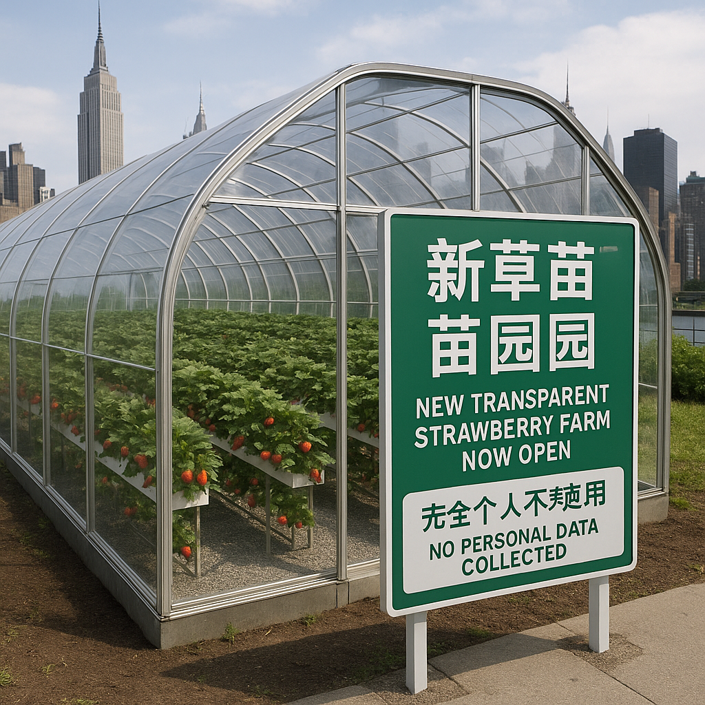

> 纽约最新落成的“透明草莓园”声称把整颗草莓的一生公开直播，却又拍着胸脯保证绝不收集任何隐私数据。摄像头无死角、数据零存储——这到底是农业乌托邦，还是数字时代的《楚门的世界》？
<!-- truncate -->

>

&nbsp;&nbsp;&nbsp;&nbsp;[纽约讯] 近日，全球第一座透明草莓园在纽约正式开园，吸引了众多媒体的关注。这个创新农业项目不仅声称可以种出无污染的草莓，还自豪地宣称将草莓种植过程完全公开，绝不隐瞒任何细节，包括苜蓿、土壤成分以及虫子是否如期进驻。

&nbsp;&nbsp;&nbsp;&nbsp;据园区负责人称，透明草莓园的设计灵感来源于现代消费者对食品生产透明度的渴望。他在开幕式上表示：“我们希望顾客在品尝草莓的同时，也能看到草莓的成长历程，宛如观看一部轻松愉快的现实秀。”本次活动的主题是“你吃的每一口，都来了个亲密接触”。

&nbsp;&nbsp;&nbsp;&nbsp;除了草莓的生长过程，园区还特意设置了一系列的监控摄像头，记录每一位游客的参观动态。对此，园方表示：“我们不过是想让顾客毫无顾虑地享受草莓的美味与新鲜，我们并不会把这些数据转化成商业信息。”东、南、西、北四个角落的监控摄像头不断拍摄游客的表情和反应，以便在草莓成熟的季节，制作成回顾视频供顾客通过社交媒体分享。

&nbsp;&nbsp;&nbsp;&nbsp;这一设计引发了许多客人的讨论，有人在社交媒体上发言称：“这真的是一个尝试让农业更透明的大胆尝试，但我可不想被拍到意外草率吃草莓的尴尬瞬间！”

&nbsp;&nbsp;&nbsp;&nbsp;尽管存在众多看法，园方似乎并不在乎这种争议。员工们对这一新颖的种植形式感到振奋，因为这不仅为透明草莓园带来了人气，还使他们看到了新的农业供应链模式。凭借投资人充沛的资金，园方计划在未来拓展开设透明的胡萝卜园、透明的土豆园等其他种植项目。

&nbsp;&nbsp;&nbsp;&nbsp;虽然顾客们已开始大批涌向这个透明草莓园，可是，关于顾客隐私数据的收集仍然是一个隐忧。为了响应社会对隐私问题的关切，园方在其官网上明确表示：“我们绝对不会追踪涉及隐私的任何信息，如体重、年龄、性别等，您只需享受草莓的美味。”

&nbsp;&nbsp;&nbsp;&nbsp;尽管如此，也有业内人士警告：如今的数据隐私是一个极具争议的话题，因此透明草莓园的经营模式能否得到长远发展的考验还有待观察。

&nbsp;&nbsp;&nbsp;&nbsp;园方为此打算推出“隐私保护日”，每月一次的活动中，顾客们将可以自由选择是否被拍摄，并接受园方寓教于乐的隐私保护技巧培训。透过这种方式，透明草莓园希望能够增加透明度的认同感，但是否能让消费者安心享受草莓，我们将继续关注。

&nbsp;&nbsp;&nbsp;&nbsp;此举引发的热议和全新体验设想已经搅动了市场，许多商家纷纷效仿试图在透明农业方面寻求创新。对普通吃货来说，似乎只需继续享受草莓的味道无疑是最开心的选择。

（完）ci自动生成
ci自动生成
