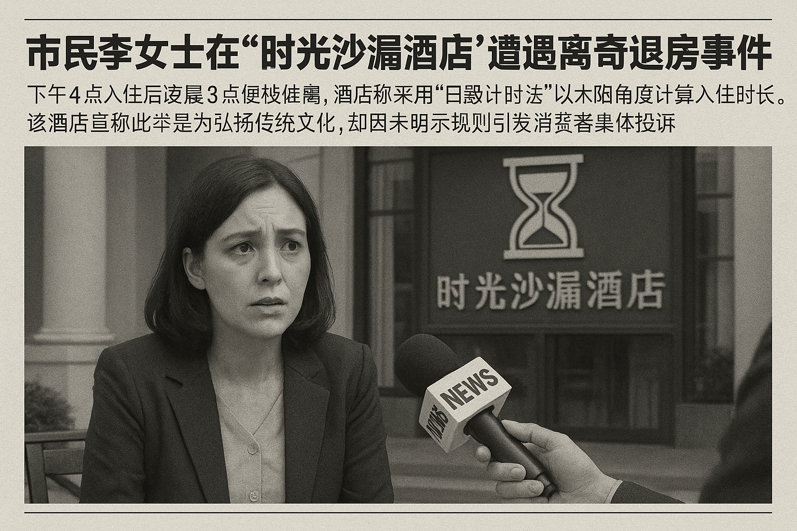

>市民李女士在‘时光沙漏酒店’遭遇离奇退房事件，下午4点入住后凌晨3点便被催离，酒店称采用‘日晷计时法’以太阳角度计算入住时长。该酒店宣称此举是为弘扬传统文化，却因未明示规则引发消费者集体投诉。
<!-- truncate -->

近日，市民李女士向本报反映，她在位于市中心的‘时光沙漏酒店’遭遇了一场‘穿越式’退房风波。李女士于8月7日下午4点办理入住，原计划次日中午12点退房，不料凌晨3点便被前台电话叫醒：‘您的入住时长已达日晷计时标准，请尽快办理退房手续。

据李女士描述，她第一时间赶到前台询问缘由，值班经理拿出一本《古代计时智慧指南》解释：‘我们酒店采用创新的“日晷计时法”，以入住时刻太阳与地平线的夹角为基准，计算当日日照时长作为入住时限。您入住时太阳夹角为30度，对应古代“晡时”，按《授时历》推算，有效入住时长仅11小时。

记者实地探访发现，该酒店大堂显眼位置悬挂着巨型日晷模型，墙上贴着‘传承华夏计时文化’的宣传标语。前台电脑屏幕显示着实时太阳角度数据，旁边还摆着《天工开物》《梦溪笔谈》等古籍。一位刚办理完‘紧急退房’的王先生苦笑道：‘我昨晚9点入住，结果凌晨1点就被通知“月晷显示已过子时，需重置计时”，这哪是住酒店，简直是上天文课。

针对消费者质疑，酒店总经理张守时回应：‘我们旨在通过商业创新弘扬传统文化，目前已申请“动态日晷计时酒店管理系统”专利。经测算，采用此方法后，酒店日均翻台率提升40%，还能让客人体验“日出而作，日入而息”的传统生活。

市场监管部门工作人员表示，已接到多起类似投诉，正在核查该酒店是否存在未明示收费规则、强制消费等问题。值得注意的是，有消费者发现，酒店在官网预订页面最下方用8号小字标注：‘特殊计时规则解释权归酒店所有’，字体颜色与背景色几乎融为一体。

截至发稿，该酒店仍在正常运营，前台电子屏滚动播放着‘今日最佳入住时段：卯时（5-7点），可享15小时超长入住’的促销信息。
