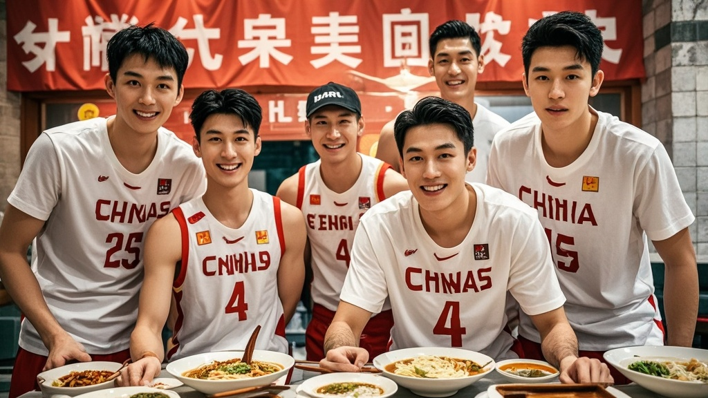

>中国男篮亚洲杯四强背后惊现‘续面玄学’：赛前集体光顾的面馆因‘免费续面’规则，意外让球员因‘吃嗨了’产生积极心理暗示，助力胜利。面馆因此爆红，老板考虑推出‘赢球续面’新规则，引发球迷和餐饮界热议。
<!-- truncate -->

北京时间8月14日，中国男篮以79:71力克韩国队，时隔十年重返亚洲杯四强的消息引爆全网。但据《洋葱体育报》独家调查，这场胜利背后竟藏着一个令所有人跌破眼镜的‘续面玄学’——球队赛前集体光顾的‘老陈记刀削面’，因‘免费续面’规则意外成了‘秘密武器’。

<strong>教练组误打误撞触发‘续面buff’</strong> 据随队记者透露，为缓解赛前紧张情绪，主教练郭明远（注：虚构姓名）13日晚率队前往酒店附近的‘老陈记刀削面’用餐。原本计划‘每人一碗垫肚子’，却因服务员一句‘免费续面不限量’彻底改变节奏。前锋王俊岩（注：虚构姓名）回忆：‘我第一碗刚吃完，小吴（中锋吴铁山，虚构姓名）就喊“老板再来三碗”，结果越续越上头，最后全队连吃17碗，撑得训练服都扣不上。’

<strong>面馆老板懵了：续面规则要改‘赢球版’？</strong> 面馆老板陈建国面对突然涌来的媒体采访，举着面勺直挠头：‘我这店开了八年，就图个实在才搞免费续面，谁能想到一群大小伙子能把我半袋面粉造完？’更令他意外的是，赛后有球迷举着‘续面总冠军’的灯牌来店打卡，甚至有家长带孩子来‘沾喜气’，声称‘吃了续面考试能超常发挥’。目前陈老板正考虑调整规则：‘要不改成“赢球续面”？中国队每进四强，来店顾客免费续三碗！’

<strong>营养专家：这可能是‘心理暗示’的胜利</strong> 体育营养学教授李芳（虚构姓名）分析：‘从科学角度，过量碳水摄入可能影响运动状态，但球员们赛前因‘续面’产生的集体归属感和愉悦感，反而形成了积极的心理暗示。’她同时提醒：‘普通球迷请勿模仿，毕竟专业运动员的代谢能力和咱们不一样。’

截至发稿，中国男篮训练馆已悄悄挂起‘续面精神永流传’的横幅，而‘老陈记刀削面’的外卖订单量较前日暴涨300%，老板正连夜联系面粉厂补货。下一场对阵伊朗的关键战，不知‘续面玄学’还能否继续奏效？

