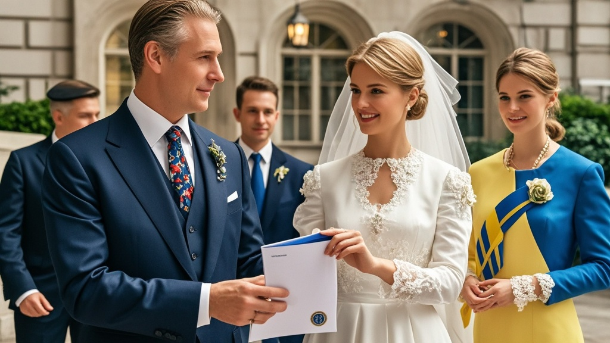

>白厅礼宾司因实习生失误，向乌克兰及欧洲代表团发送「婚礼礼仪版」元首会晤着装规范，要求核查领带花纹、袖扣材质等细节，引发外交小插曲，最终证实为工作失误。
<!-- truncate -->

<h3>本报华盛顿讯（特派记者 安娜·琼斯）</h3> 当地时间8月18日，一场因「领带花纹」引发的外交小插曲，让原本备受关注的「特扎会」（特伦特总统与扎哈罗夫总统会晤）提前登上了全球娱乐版头条。  据白厅内部人士向本报独家透露，在扎哈罗夫总统抵达华盛顿前48小时，白厅礼宾司突然向乌克兰代表团发送了一份长达12页的《元首会晤着装规范补充说明》，其中除要求「必须着深色西装」外，还特别标注：「领带需采用宽度不超过7.2厘米的斜纹图案，禁止使用波点、条纹及任何包含国家象征元素的设计；袖扣材质建议选择钛合金或陶瓷，黄金、钻石类装饰可能引发『过度炫富』误判；袜子颜色需与皮鞋同色系，色差不得超过潘通色卡3个色号」。  「我们的外交顾问当时都懵了，」乌克兰代表团发言人在记者会上哭笑不得，「上一次收到这么详细的着装要求，还是2019年参加摩纳哥亲王的婚礼。」更令人啼笑皆非的是，当乌方询问规范出处时，白厅礼宾司竟支支吾吾表示「参考了《国际社交礼仪大全（2023修订版）》」。  消息一经曝光，欧洲陪同代表团也纷纷「晒出」自己收到的「特殊要求」——德国总理助理透露，德方被提醒「袖扣刻字不得超过3个字母」；法国总统办公室则收到「衬衫领口与脖子间需容得下一根手指」的「科学建议」；北约秘书长私人秘书甚至收到「握手时手掌湿度需控制在40%-60%」的「专业指导」。  面对舆论质疑，白厅新闻秘书在紧急记者会上红着脸解释：「经核查，这是礼宾司一名新入职实习生的工作失误——该员工误将《高端婚礼策划指南》电子版当作《元首外交礼仪规范》上传至内部系统。目前涉事实习生已被安排去国会山学习《外交十诫》，相关错误要求即刻作废。」  截至发稿，扎哈罗夫总统已身着经典黑西装抵达白厅，领带选择了最保险的素色暗纹款。特伦特总统则穿着他标志性的「权力红」领带热情迎接——据悉，这条领带的波点图案恰好是实习生失误前被「禁止」的款式。 
<i>（注：本文为虚构幽默新闻，所有细节均为艺术创作，请勿与真实外交事件关联）</i>
