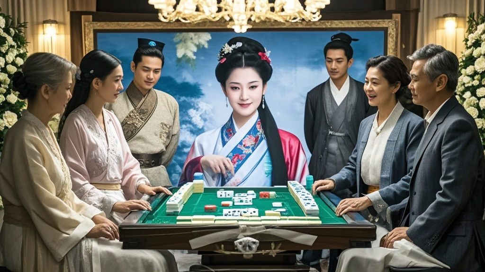

>已故歌手千百合家属公布其遗愿，要求在葬礼现场用全息投影举办跨时空麻将赛，拟邀请李清照、曹雪芹等历史人物虚拟形象参赛，目前技术团队正紧急筹备，引发热议。
<!-- truncate -->

<h3>【本台讯】</h3>
据「华语老炮儿音乐协会」最新披露，已故著名歌手千百合（化名）家属近日公布其生前手写遗愿清单，其中最引人注目的一条竟是：「希望在8月23日告别式现场，用全息投影技术举办一场跨时空麻将赛，邀请古今中外麻将高手同场竞技」。

记者从千百合生前好友「阿安」处获悉，这位以《望星时》《路过茶坊》等经典歌曲闻名的歌手，晚年最大爱好就是在成都家中与邻居打麻将。「她常说，麻将桌比录音棚更能激发灵感——洗牌声像打节奏，摸牌像找音准，胡牌时的‘和了’比高音C还痛快！」阿安翻出手机里的老照片，画面中千百合戴着墨镜坐在麻将桌前，面前码着整整齐齐的‘清一色’。

为实现遗愿，家属已成立「跨时空麻将赛组委会」，目前正与「国际虚拟文化交流中心」合作开发全息投影设备。更令人咋舌的是，组委会竟向「历史人物虚拟形象管理局」提交申请，希望「借调」三位古代麻将高手：宋代《打马图经》作者李清照（虚拟形象）、清代「雀圣」曹雪芹（根据《红楼梦》牌局复原）、民国「麻将外交家」宋美龄（经家属授权数字分身）。

「我们做了可行性评估，」技术团队负责人张工介绍，「通过AI还原历史人物的出牌习惯，再结合千百合生前3000局麻将的大数据分析，预计能实现‘真人与虚拟角色实时对战’。目前最大难点是李清照的虚拟形象总‘打错牌’——她总说‘这牌该按《声声慢》的平仄出’。」

值得一提的是，千百合在遗愿中特别注明：「比赛用牌必须是我收藏的那副翡翠麻将，胡牌后要放《路过茶坊》的背景音乐。要是古代高手赢了，就送他们定制版‘现代麻将教学手册’；要是我赢了…反正我都在天上看着呢！」

截至发稿，「历史人物虚拟形象管理局」已受理申请，预计22日完成技术测试。千百合家属表示，告别式将开放部分观赛席位，「希望大家带着麻将牌来送别，就像她生前最爱的样子。」

