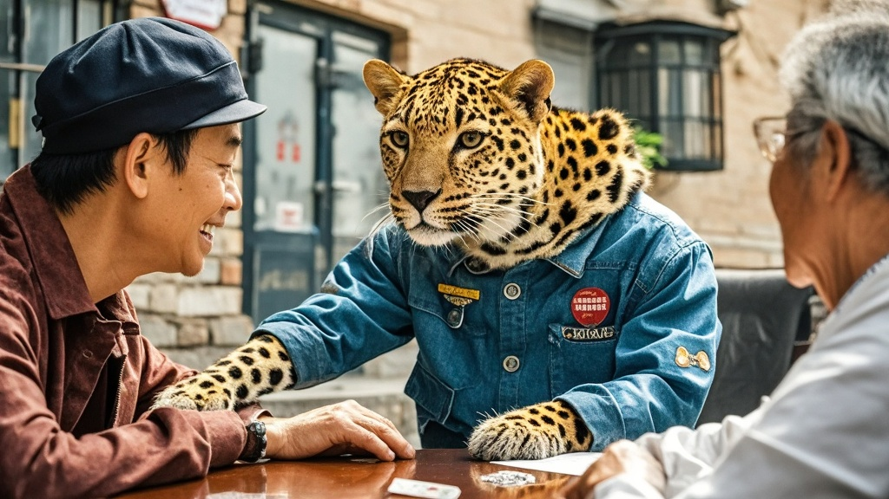

>太原市太新小区惊现非洲豹'斑斑'，每日准时参与业委会会议并与居民互动。园方借机推出'撸豹月票'，引发业主热议与动物专家关注，物业正协商'豹籍'管理问题。
<!-- truncate -->

近日，太原市太新小区因一只非洲豹的'入职'引发全城关注。据多位业主反映，这只名为'斑斑'的非洲豹自8月15日起，每日早晨7点准时出现在小区中心广场，完成'三件套'：在喷泉边喝十分钟水、绕健身器材区慢跑三圈、最后端坐在业委会办公室门口等待会议开始。

记者实地探访时看到，'斑斑'正端坐在业委会会议桌旁，前爪搭在桌上，目光随着投影仪上的'停车位改造方案'来回移动。业主王阿姨笑着介绍：'刚开始以为是动物园跑出来的，结果它连续三天都来听会，上次讨论宠物粪便清理问题时，还特意用尾巴拍了拍自己的食盆——您说这是不是在表态支持加强管理？'

更令人称奇的是，小区南门的'萌宠乐园'近日推出'撸豹月票'服务。园方负责人李经理展示价目表：'早鸟票99元/月，包含每日15分钟互动时间，提供专业手套和护具。昨天第一天发售就卖了87张，很多家长说孩子现在主动早起，就为了和斑斑一起做晨操。'

对此，山西动物保护协会专家张教授表示震惊：'非洲豹属于濒危物种，正常活动范围至少需要50平方公里。这只个体看起来健康状况良好，初步判断约3岁，但完全不符合城市生存特征。'当被问及是否担心安全问题时，李经理指了指墙角的监控：'您看，斑斑每次看到小朋友都会主动躺平翻肚皮，比我们小区那只总咬人的柯基温顺多了。'

目前，小区物业已紧急召开临时会议，议题包括：是否为'斑斑'申请'业主临时居留证'、是否将其纳入小区宠物管理费缴纳范围、以及如何规范'豹务委员'的参会表决权。物业主任赵先生苦笑着说：'现在业主群里分成两派，一派要给斑斑投票权，另一派要选它当形象大使——我们正联系动物园核实身份，不过按这架势，就算找到原主，估计也舍不得接走。'

