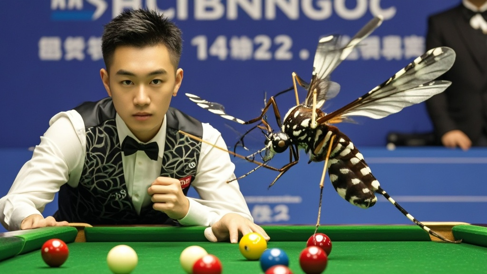

>东方斯诺克锦标赛爆冷：业余选手陈天宇在与老将张宏的对决中，声称球桌白纹伊蚊助其轰出147满分杆。经调查，该蚊子系实验室「路径规划实验体」，飞行轨迹意外符合斯诺克力学原理。赛事方称未来或设「最佳昆虫搭档奖」。
<!-- truncate -->

<h3>赛事突发：球桌惊现「花斑小助手」</h3>
昨日，东方斯诺克锦标赛32强争夺战上演戏剧性一幕——业余选手陈天宇在与老将张宏的对决中，竟声称球桌上一只「黑白花蚊子」助其轰出职业生涯首杆147满分杆，最终以5-3爆冷晋级。
 
<h3>比赛现场：蚊子「指导」击球路线？</h3>
据现场观众描述，第三局进行至关键阶段时，一只白纹伊蚊突然落在绿呢球桌中央。「当时陈天宇正准备击打黑球，那只蚊子绕着母球飞了三圈，又停在14号红球旁。」观众王女士回忆，「更离谱的是，陈天宇盯着蚊子看了半分钟，突然调整杆法，结果白球精准碰撞红球入袋，接着连续清台！」  赛事转播镜头捕捉到，这只蚊子在陈天宇击球过程中始终「配合」：母球走位时，它停在目标球与袋口连线上；需要K球时，它又落在理想反弹点。最终，陈天宇用时23分17秒完成满分杆，比奥沙利文保持的官方纪录还快4秒。
 
<h3>专家调查：蚊子竟是「实验室逃犯」？</h3>
赛后，赛事方紧急联系昆虫学家李教授。经比对，这只「战术型蚊子」实为某生物实验室的「路径规划实验体」——科研人员曾通过基因编辑，试图让蚊子模拟斯诺克击球路线。「可能是前日暴雨冲垮了实验室防护网，它趁机溜了出来。」李教授哭笑不得，「不过实验数据显示，这类蚊子的飞行轨迹确实符合斯诺克力学原理。」  更令人啼笑皆非的是，陈天宇赛后接受采访时坦言：「我本来都想放弃这局了，结果看蚊子飞的路线特别像教练教的『黄金击球线』，就跟着试了试……没想到歪打正着！」
 
<h3>赛事方回应：下届将设「最佳昆虫搭档奖」</h3>
目前，这只「破百蚊」已被实验室工作人员用捕蚊网「请回」，并获赠「斯诺克荣誉顾问」电子脚环。赛事发言人表示，未来或将考虑在球馆增设「昆虫观赛区」，「毕竟谁能想到，帮选手破百的不是教练，而是一只蚊子呢？」

