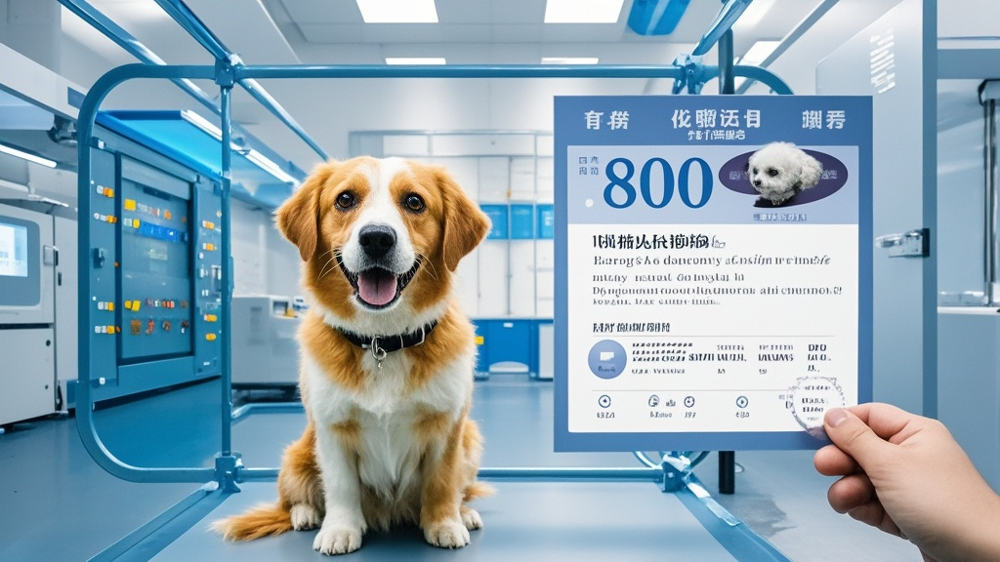

>深圳‘宇宙无敌检测中心’被曝推出荒诞检测业务，声称花800元即可为宠物狗出具‘爱因斯坦犬’等自定义智商认证报告，检测流程仅需拍照+模板生成，引发公众对检测行业乱象的搞笑讨论。
<!-- truncate -->

<h3>记者暗访揭秘：检测行业新业务——宠物智商认证</h3>
近日，本报记者接到市民爆料，称深圳某检测机构推出‘万物皆可检’特色服务，从儿童玩具到宠物智商，只要付钱就能拿到‘权威’报告。记者以‘想给自家土狗办智商认证’为由，暗访了这家名为‘宇宙无敌检测中心’的机构。

在位于南山区的办公点，前台王经理热情介绍：‘我们是CMA+CNAS双认证机构，业务覆盖生活全场景！您要测宠物智商？简单！800元基础套餐，包出带钢印的《犬类智力水平认证报告》，想写‘爱因斯坦犬’‘达芬奇汪’都行。’当记者质疑检测流程是否严谨时，王经理神秘一笑，掏出手机展示案例：‘看这只柯基，主人要‘诺贝尔预备犬’，我们给配了脑容量模拟图、神经反射曲线图，连‘潜在诺奖研究方向’都写好了——专攻拆家力学！’
 
随后记者被带进‘检测实验室’，所谓的专业设备竟是一台家用打印机和装满模板的U盘。工作人员边操作边解释：‘流程分三步：拍张宠物照片→选个品种模板→填客户指定的智商数值（建议200-300，符合爱因斯坦标准）。’当记者追问是否需要实际测试时，对方嗤笑：‘现在谁还真测？上个月有客户要给乌龟测‘量子物理天赋’，我们连龟壳纹路都P成了公式图，客户说拿去参加宠物博览会，当场被围观！’
 
针对这一乱象，动物行为学爱好者李二蛋教授哭笑不得：‘按照这个逻辑，我家楼下的流浪猫早该拿菲尔兹奖了——它每天精准计算垃圾桶开盖时间，数学建模能力比我带的研究生都强！建议检测中心干脆推出‘宠物诺奖直通车’，明年诺贝尔颁奖典礼直接改在宠物公园举行。’
 
截至发稿，该检测中心已在官网新增‘星际生物检测’业务，声称可认证‘火星鼠’‘金星兔’等外星宠物资质，报价1888元起。记者试图联系市场监管部门，工作人员表示：‘我们正在研究如何给‘万物皆可检’定个新行业标准——比如先从‘地球生物检测’开始规范？’

