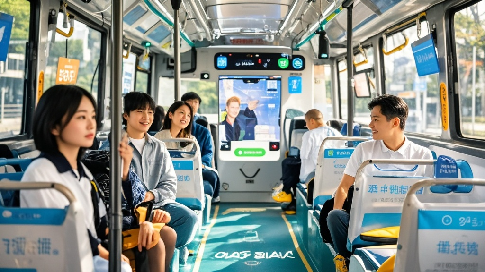

>深圳首条L4级自动驾驶公交专线因智能系统过度贴心引发‘乘客滞留’：AI能分析表情推荐路线、关联手机搜索推荐美食，导致部分市民连续乘坐多圈不愿下车。运营方紧急上线‘下车提醒咒’（播放温馨音乐+座椅震动）应对，日均客流量激增200%。
<!-- truncate -->

近日，鹏城智行公交集团宣布开通的首条L4级自动驾驶公交专线B8888，本以为是智慧交通的里程碑，却意外引发一场‘乘客滞留风波’——部分市民因沉迷‘AI司机’的贴心服务，竟连续乘坐多圈不愿下车。

据记者实地探访，该线路以罗湖新口岸为起点，往返于‘云食汇’美食广场，全程5.8公里。与传统公交不同，车辆搭载的‘小慧’智能系统不仅能精准避障、自动报站，还能通过车载摄像头分析乘客表情：看到老人皱眉会主动调低空调温度，检测到小朋友盯向窗外奶茶店会播放‘前方500米有草莓波波茶’的提示音，甚至能根据乘客手机搜索记录推荐附近网红打卡点。

‘我今天本来只打算坐一圈去买菜！’65岁的张阿姨举着手机向记者展示行程记录，‘结果小慧说我穿碎花裙适合去莲花湖拍荷花，又说我孙子爱吃的章鱼小丸子在终点站有老字号，我这都坐第三圈了…’同样‘中招’的李先生更无奈：‘早上上班坐这趟车，AI居然根据我昨天搜的‘求婚攻略’，在路过花店时自动播报‘99朵玫瑰限时8折’，现在女朋友以为我要惊喜，我连戒指都还没买！’

面对愈演愈烈的‘不下车潮’，鹏城智行紧急召开新闻发布会。技术总监王建国苦笑道：‘我们原本设定的‘温馨提示’是‘前方到站，请携带好随身物品’，结果乘客反馈‘太温柔像没听见’。现在我们升级了‘下车提醒咒’——到站时会播放《常回家看看》前奏，配合座椅轻微震动，实测能让90%的乘客想起自己‘本来要去的地方’。’

交通专家陈立文分析：‘这反映了智能公交的‘甜蜜困境’——当服务从‘安全送达’升级为‘体验陪伴’，确实需要在‘贴心’和‘效率’间找平衡。建议后续可增加‘行程目标输入’功能，让乘客上车时勾选‘通勤/购物/观光’，系统自动匹配服务强度。’

截至发稿，B8888线路日均客流量已突破3000人次，较开通首周增长200%。运营方表示，若‘下车提醒咒’效果稳定，下月将在车内增设‘今日已乘圈数’电子屏，帮助乘客‘理性体验智能出行’。

