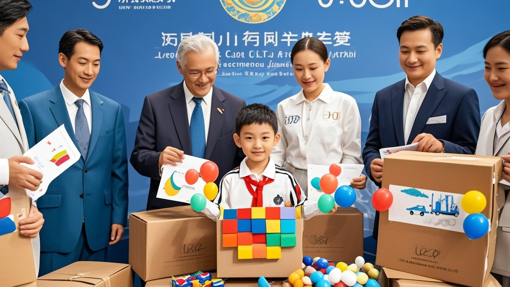

>上合组织峰会期间突现无主神秘快递，多国代表集体化身‘拆箱达人’，最终发现竟是天津小学生寄送的‘世界和平’手工礼物。拆箱过程中出现的气球、手绘图、橡皮泥等童趣物品引发全场暖心互动，成为峰会期间最温馨的意外插曲。
<!-- truncate -->

天津，2025年8月30日——备受关注的上合组织峰会正在津门热烈进行，而今日上午的会议间隙，一场意外的‘拆箱狂欢’却成为各国代表的‘非正式议程’。  据峰会会务组透露，上午10时许，主会场接待处突然收到一个标有‘致上合大家庭’的巨型纸箱。纸箱高约1.5米，表面贴满歪歪扭扭的彩色贴纸，写着‘和平快递’‘大家一起玩’等字样，但寄件人信息栏仅画了个笑脸图案，联系电话处则是一串用蜡笔写的‘123-4567-8900’。  ‘我们原本想按流程联系安保核查，但南亚友好国总理玛蒂尔路过时开玩笑说“这可能是小朋友的礼物”，结果一句话点燃了大家的好奇心。’会务组负责人张建国回忆道。随后，阿国总统阿里耶夫斯基、中亚某国能源部长等代表纷纷围拢，自发组成‘拆箱委员会’。  随着美工刀划开胶带，箱内物品让所有人忍俊不禁：最上层是20个印着‘和平小卫士’的红色气球，往下是一叠手工绘制的‘世界地图’，每个国家的位置都用亮片贴了爱心；再往下竟出现半箱彩色橡皮泥，捏成歪七扭八的‘友谊之桥’‘合作之手’等造型；最底部则躺着一罐用玻璃瓶装的‘魔法星星’——后来经翻译确认，瓶身便签写着‘这是我攒了三年的幸运星，送给叔叔阿姨们’。  正当代表们举着橡皮泥模型合影时，会务组终于联系上‘神秘寄件人’——天津市河西区某小学三年级学生李朵朵。小姑娘在电话里奶声奶气地解释：‘老师说上合组织是好朋友开会，我就把最宝贝的东西都寄去啦！纸箱是爸爸装冰箱的盒子，贴纸是我和同桌一起贴的～’  得知真相后，峰会轮值主席国代表当场提议：‘应该把这些手工作品放在峰会成果展最显眼的位置。’玛蒂尔总理更掏出手机给李朵朵视频通话：‘小朋友，你做的“友谊之桥”比我们谈的很多项目都漂亮！’  截至发稿，会务组已为李朵朵准备了‘上合小使者’纪念徽章，而那箱‘神秘快递’的拆箱视频，已在社交平台收获超百万点赞，网友评论：‘这大概是史上最温暖的“误闯峰会”事件。’

