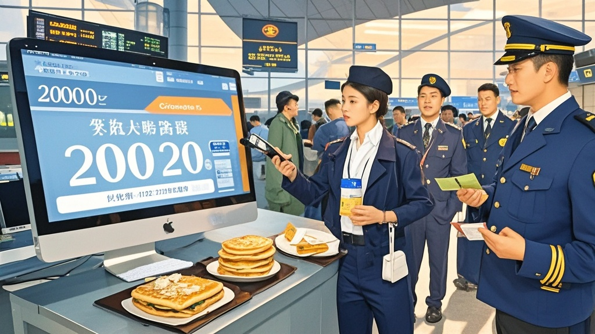

>大同某航空因系统故障将2000元国际机票标为200元，引发万人抢购潮，机场陷入混乱。煎饼摊老板被临时征用兼职值机员，官方紧急解释系系统错误，以煎饼券补偿排队市民。
<!-- truncate -->

8月31日，山西大同云冈机场上演荒诞一幕：因某航空售票系统突发'时空错乱'，原本标价2000元的9月15日大同-曼谷直飞航班，竟以200元价格在平台挂出。消息一出，大同市民连夜扛着小马扎在机场大厅排起千米长队，更有甚者从太原、呼和浩特打车赶来'捡漏'。

据现场目击者王大爷回忆：'凌晨三点机场就亮如白昼，平时卖煎饼果子的老张头推着三轮车来凑热闹，结果被工作人员拽去帮忙值机——人家摊煎饼手速快，敲键盘也利索！'记者在现场看到，值机柜台前挂着临时手写的'煎饼换登机牌'提示牌，原来部分没带手机的老人用刚摊好的煎饼抵作'手续费'，竟也顺利拿到了登机凭证。

涉事的'雁北航空'客服中心陷入瘫痪，接线员小王声音沙哑地表示：'我们系统显示这是2005年的历史价格数据被错误调用，原本应该是2005元。现在后台已经挤爆了，有位乘客说要带十箱刀削面去曼谷摆摊，还有阿姨咨询能不能带自家腌的酸菜上飞机。'

大同市文旅局紧急召开新闻发布会，局长李建国手持还热乎的煎饼解释：'我们理解大家对低价机票的热情，但经核实这是系统故障。目前已协调航空公司为前100名排队乘客提供50元煎饼券作为补偿——毕竟老张头的煎饼摊今天可是救了场。'

截至发稿，云冈机场安保人员正用扩音器循环播放：'200元机票系系统错误，请勿轻信黄牛手中的'手写登机牌'。'而煎饼摊老板老张头的三轮车旁，新挂出的广告牌格外醒目：'值机服务暂停，煎饼正常供应，凭排队号可享第二份半价'。

