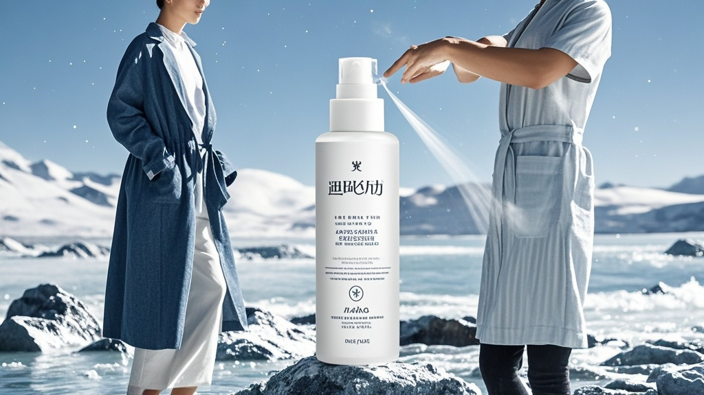

>消费者质疑百元「肤灵泉」喷雾成分仅含水，品牌方回应称使用火星极地温泉水并搭载量子保湿芯片。经检测，产品实为普通水且无特殊技术，引发市场监管介入调查。
<!-- truncate -->

近日，消费者论坛掀起热议风暴——一款售价128元的「肤灵泉舒缓调理温泉水喷雾」被网友质疑「成分表仅写『水』，实为智商税」。面对舆论浪潮，品牌方今日给出「突破性」回应，却引发更大范围的「科学困惑」。

据消费者李女士展示的产品包装，成分栏确实仅标注「水」，她在社交平台吐槽：「喷完脸更干了，这哪是保湿？分明是给空气补水！」该言论获超10万点赞，#百元喷雾成分仅水#话题迅速登上热搜前三。

针对质疑，肤灵泉官方客服今日召开线上说明会。品牌技术总监张宏宇手持「火星极地温泉水样检测报告」解释：「我们的水绝非普通自来水，而是取自火星北极地下300米的远古冰川融水，经2000℃地核高温矿化形成，富含宇宙级微量元素。」他同时展示喷头拆解图，「这款获得诺贝儿日化科技奖的微压喷头，内置量子保湿芯片，能将水分子切割成纳米级，穿透皮肤屏障后自动重组为保湿因子。」

这番「黑科技」解释引发科学界关注。日化产品检测中心研究员陈淑芬团队随即展开实测，结果却令人大跌眼镜：「经光谱分析，喷雾成分99.9%为H₂O，未检出任何特殊微量元素；喷头结构仅为普通气压装置，所谓『量子芯片』实为塑料垫片。」

事件持续发酵后，有消费者翻出产品详情页隐藏条款：「本产品功效基于火星大气环境测试，地球使用可能出现效果偏差。」对此，品牌方补充说明：「我们正在研发地球适配版喷头，预计2025年推出，升级版将增加『防干燥』模式，售价调整为198元。」

截至发稿，该喷雾销量不降反增，有消费者调侃：「买的就是『火星水』的科幻感，喷脸时仿佛在和宇宙对话。」市场监管部门表示已介入调查，重点核查「火星温泉水」「量子芯片」等宣传用语的合规性。

