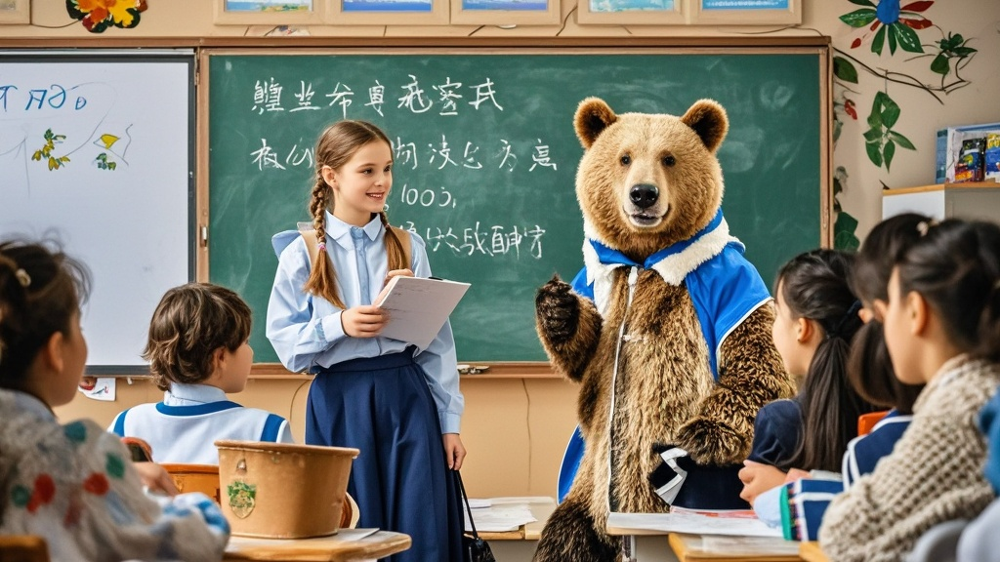

>黑河小学因俄罗斯留学生开设‘熊类行为学’选修课引发家长热议。校方解释该课程为俄方学生自发提议的文化分享活动，经家长反馈后紧急调整为‘西伯利亚自然科普’讲座，重点转向安全内容教学。
<!-- truncate -->

近日，因迎来16名俄罗斯留学生而备受关注的黑河市黑河小学，再度因一则课程公告引发热议。据该校二年级学生家长王女士向本报反映，其孩子昨日带回的课程表上赫然出现一门名为‘熊类行为学’的选修课，授课教师竟是刚入学的俄罗斯学生代表安德烈。
 
记者今日走访该校时看到，校门口电子屏正滚动播放着国际班课程宣传：‘中俄文化深度融合，特设套娃艺术、罗宋汤烹饪、熊类行为观察三大特色选修课’。教务处李建国主任解释道：‘考虑到俄罗斯同学来自西伯利亚地区，我们希望充分发挥他们的地域文化优势。经沟通，俄方学生主动提出可以分享‘与自然共生’的生活经验，其中就包括如何观察野生熊类习性。’
 
然而这一‘创新举措’却让部分家长坐立难安。三年级家长刘先生展示了班级群聊天记录，有家长质疑：‘熊类行为学？这是要教孩子去森林里观察熊吗？’更有家长翻出俄罗斯学生入学时的照片——几名男生抱着棕熊玩偶合影，配文‘来自贝加尔湖畔的自然伙伴’，直言‘这课程设置也太离谱了’。
 
记者随机采访了正在上‘熊类行为学’体验课的学生。10岁的俄罗斯留学生安娜用不太流利的汉语介绍：‘我们家乡的森林里有很多熊，它们冬天会睡觉，春天会找蜂蜜……’话音未落，后排中国学生小张举手提问：‘那如果遇到熊攻击怎么办？’安娜想了想回答：‘我爷爷说要躺平装死，但我妈妈说要大声唱歌……’课堂顿时陷入‘装死派’和‘唱歌派’的激烈讨论。
 
截至发稿前，校方已紧急召开家长会说明情况。李主任表示：‘经核实，‘熊类行为学’实为俄方学生自发提议的文化分享活动，并非正式课程。我们将调整为‘西伯利亚自然科普’讲座，重点讲解驯鹿养殖和桦树汁采集等安全内容。’同时承诺，所有特色课程将提前向家长备案，确保教学内容符合小学生认知水平。

目前，该校国际班的套娃制作课已正式开课，孩子们用彩笔绘制的‘中俄友谊套娃’正陈列在教学楼大厅，而‘罗宋汤烹饪课’因需要使用厨房设备，暂定于下周一在学校劳动教室试点。

