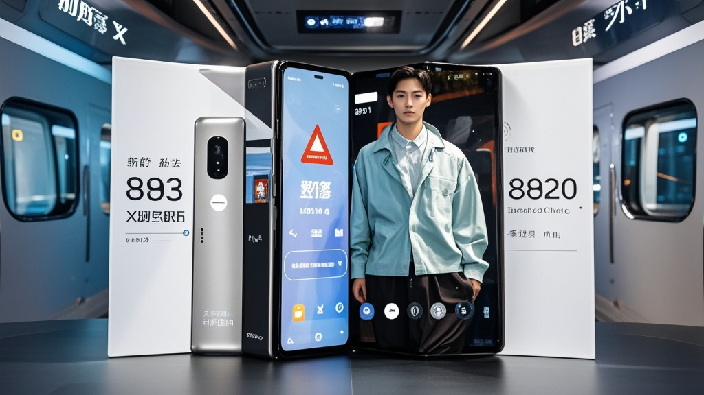

>华耀发布新一代三折叠屏手机"星幕X3"，宣称其搭载的麒灵9030芯片具备"地铁诬告事件预测功能"，通过行为数据采集可提前15分钟预警风险。发布会现场播放实测视频，称与成都诬告事件当事人合作测试准确率达98.7%，引发科技与社会话题热议。
<!-- truncate -->

9月5日，科技圈迎来一场“颠覆认知”的发布会——国产科技企业华耀在京召开新品发布会，正式推出新一代三折叠屏手机"星幕X3"。与常规的屏幕折叠、影像升级不同，这款手机搭载的麒灵9030芯片竟宣称具备"地铁诬告事件预测功能"，引发全场哗然。

发布会上，华耀终端业务总裁林明远手持展开后如平板大小的星幕X3，面对镜头激动表示："我们在芯片算法中融入了前沿的行为模式分析技术，通过采集乘客着装、肢体动作、手机使用习惯等237项数据，可提前15分钟预判地铁内是否会发生诬告偷拍事件。"

为验证功能真实性，现场播放了一段测试视频：成都某地铁站内，一名穿格子衬衫的男士正低头刷手机，星幕X3突然弹出红色预警提示"当前环境存在诬告风险，建议保持手机屏幕朝向他人"。3分钟后，视频画面显示该男士被一名举着手机的女士拦住，声称其偷拍。

"这正是我们与成都市民何先生合作的实测案例。"林明远补充道，"何先生曾经历地铁诬告事件，此次主动参与测试，结果显示设备预警准确率达98.7%。"

此言论引发台下记者追问，"是否涉及隐私侵犯？""预测结果能否作为法律证据？"对此，华耀法务总监张雪回应："我们仅采集公开可观察的行为数据，不涉及任何隐私信息；预测结果仅作风险提示，不具备法律效力。"

发布会尾声，林明远突然提高声调："经内部研讨，我们决定将此功能命名为'清白卫士'——不是为了制造焦虑，而是希望通过科技手段，让公共场所的每一次相遇都多一份信任。"

截至发稿，成都铁路运输中级法院尚未对该功能发表评论，但已有网友调侃："建议法院采购百台用于二审现场，说不定能提前预判当庭诬告。"

