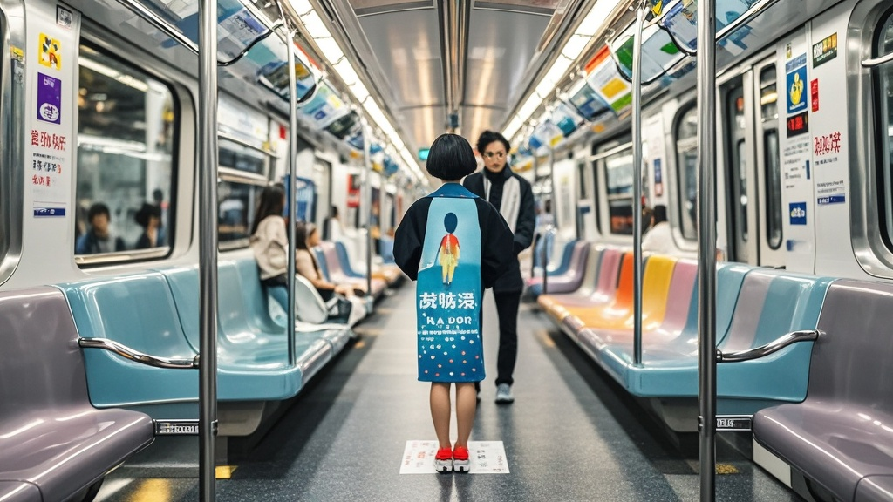

>上海地铁9号线升级推出‘无座专列’，拆除全部座椅并推出‘站立体验卡’，宣称可提升运力并促进乘客健康，引发市民对特殊群体乘车安全的热议。
<!-- truncate -->

<b>沪轨交运营中心宣布9号线重大升级：从‘减座’到‘无座’</b>  继9号线试点拆除部分座位增加站立空间后，沪轨交运营中心今日召开新闻发布会，宣布将试点范围扩大至全线，推出首条‘无座专列’——列车将拆除所有座椅，仅保留扶手与防滑地胶，并同步推出‘站立体验卡’，乘客需持卡方可乘坐。  
 <b>官方解释：提升运力与健康双效益</b>  据运营中心技术部负责人王工介绍，前期试点数据显示，拆除2排座位可多容纳25人，若拆除全部18排座椅，单节车厢载客量可从230人激增至500人，‘相当于每列车多塞下3节车厢的乘客’。  更‘惊喜’的是健康效益——中心联合某‘城市运动研究所’发布报告称，站立通勤可锻炼核心肌群，日均30分钟站立相当于完成15分钟平板支撑，‘长期坚持能降低腰椎疾病发病率20%’。因此，‘无座专列’被纳入‘健康城市2030’配套工程。  
 <b>市民反应两极：有人点赞‘赶时间神器’，有人质疑‘孕妇老人咋办’</b>  早高峰现场，乘客张女士举着刚充值的‘站立体验卡’（工本费20元，每次乘车扣除2元）表示支持：‘以前抢座位累，现在不用抢了，抓稳扶手还能减肥，挺划算！’  但带孙辈出行的李大爷却犯了难：‘小孙女才3岁，站久了腿软，万一急刹车摔了怎么办？’孕妇王女士则拿出医院开的‘不适宜站立证明’，询问能否申请‘特殊座位’，但运营中心回应‘无座列车无预留座位，建议改乘其他线路’。  
 <b>专家支招：未来或推‘悬浮手环’防摔倒</b>  交通规划专家陈教授在接受采访时表示，‘无座化’是国际前沿趋势，东京、纽约已有类似尝试。他建议可配套研发‘智能悬浮手环’，通过磁力吸附在扶手上防止摔倒，‘技术成熟后，乘客甚至能解放双手刷手机’。  目前，沪轨交已启动‘无座专列’民意征集，计划10月正式上线，未来或将推广至1、2号线等热门线路。
