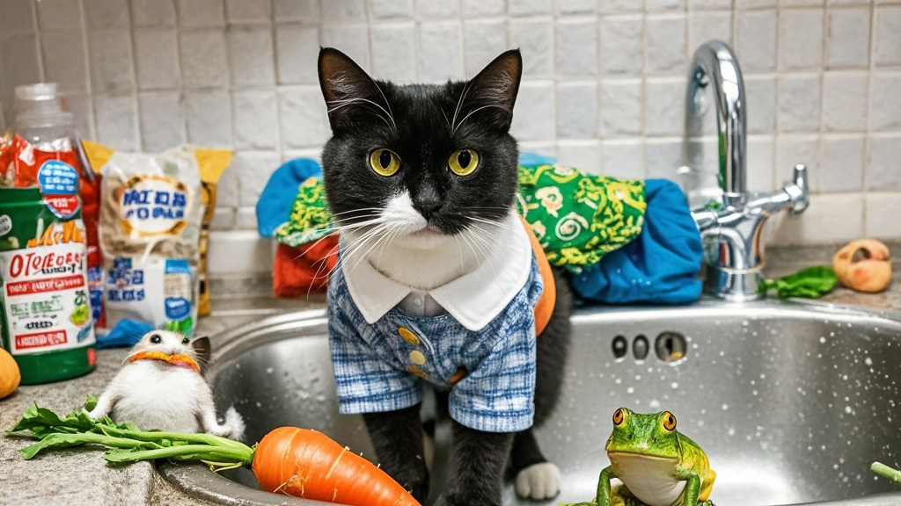

>福州李女士养的中华田园猫'煤球'近期频繁往洗碗池投递'惊喜礼包'，从活老鼠、青蛙到便利店萝卜等，引发邻居效仿现象，动物专家推测系猫咪'狩猎本能'的特殊表现。
<!-- truncate -->

近日，福州马尾区的李女士向记者展示了自家洗碗池的'特殊收藏'——从活老鼠到青蛙、塑料玩具车，甚至还有半块啃过的玉米，这些'礼物'均来自她养了两年的中华田园猫'煤球'。
 

'最开始是9月4号早上，我准备煮早餐，一掀开洗碗池的沥水篮，发现里面盘着只还在抽搐的老鼠。'李女士指着手机里的视频介绍，'当时吓得我连刚买的新砂锅都扔了，结果第二天更离谱——池子里出现了三只小跳蛙，还带着泥。'
 

据李女士统计，近一周内，煤球已累计'投递'12件'礼物'，种类涵盖啮齿类、两栖类、塑料制品及疑似邻居家的儿童玩具。更令人啼笑皆非的是，9月7日清晨，池子里竟出现了一个用树叶包裹的'神秘包裹'，打开后发现是半块印着某便利店logo的关东煮萝卜。
 

'现在我家洗碗池成了'盲盒机'，每天起床第一件事就是戴橡胶手套翻找。'李女士哭笑不得，'社区宠物医生说这是猫的'狩猎本能'，但我查了资料，正常猫最多送小鸟老鼠，哪有送便利店萝卜的？'
 

记者走访发现，附近3户养猫家庭也反映近期出现类似情况：王大爷家的橘猫开始往阳台送快递单，张女士的布偶猫则迷上了叼回儿童发卡。对此，动物行为学专家陈教授解释：'可能是近期小区灭鼠行动导致猎物减少，猫咪被迫'开发新货源'，不排除部分'礼物'来自垃圾桶或邻居丢弃物。'
 

截至发稿，李女士已在洗碗池加装防漏网，并给煤球购置了智能逗猫机。'昨天它对着机器玩了半小时，终于没往池子里塞东西——希望这招能让我的早餐锅多活几天。'李女士望着厨房说。

（注：本新闻系虚构，旨在以趣味方式呈现人与宠物的日常互动）

