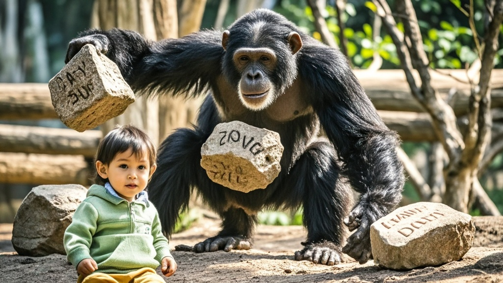

>隆兴野生动物世界明星黑猩猩'金刚'因沉迷学习人类新媒体互动，模仿'实体弹幕'投掷刻字石块，意外砸伤2岁幼儿。园方自曝曾为其配备平板学习科普，现推出'防沉迷'教育及'安全互动体验包'应对，引发跨物种社交行为的热议。
<!-- truncate -->

<h3>【本台讯】</h3>
9月8日下午，隆兴野生动物世界发生一起'跨物种互动'意外事件——园区明星黑猩猩'金刚'在展示区向游客投掷石块，导致一名2岁幼儿手指轻微擦伤。事件经游客社交媒体发酵后，园方今日召开特别发布会，竟爆出'金刚近期沉迷学习人类新媒体互动'的惊人内幕。

<strong>现场还原：石头里藏着'点赞密码'？</strong> 据目击者李女士回忆，当时她正抱着孩子在黑猩猩展区拍照，突然'嗖'的一声，一块鸡蛋大小的石头砸中宝宝手背。'我抬头看时，金刚正蹲在假山顶上，双手举着石头冲我们摇晃，像在比划什么手势。'李女士展示的视频显示，黑猩猩投掷石头前确实做出类似'点赞'的手部动作。

园区兽医师张磊透露，经检查发现，金刚投掷的石头表面有明显人工打磨痕迹，部分石块甚至刻着'666''顶'等字样。'我们调取监控发现，最近三个月金刚每天都会在玻璃窗前观察游客玩手机，尤其对点赞、发弹幕等互动行为特别关注。'

<strong>园方自曝：曾给猩猩配平板'做科普'</strong> 更令人大跌眼镜的是，隆兴野生动物世界总经理王强在发布会上坦言，为提升动物福利，园区今年3月特别为金刚配备了一台防摔平板电脑，内置《动物行为学》《人类社交指南》等科普视频。'我们本意是让它通过学习减少刻板行为，没想到这孩子（指金刚）自学能力太强。'王强苦笑着展示平板电脑使用记录——近一个月来，金刚观看'网友用石子摆爱心'、'弹幕文化'等视频超过50小时。

现场播放的监控录像显示，金刚会模仿视频里的动作：看到'点赞'画面就举左手，看到'发弹幕'就拍玻璃，而投掷刻字石块竟是它自创的'实体弹幕'。'它可能以为扔石头是在和游客'互动'，就像我们发评论一样。'张磊解释道。

<strong>专家：动物行为学研究需'防沉迷'？</strong> 动物行为学教授陈建国在接受采访时表示，黑猩猩的认知能力相当于5-7岁儿童，模仿人类行为并不罕见，但'主动学习新媒体互动'尚属首次发现。'这提醒我们，在开展动物科普教育时，需要建立类似儿童'防沉迷'的内容筛选机制，避免动物误读人类行为。'

针对此次事件，隆兴野生动物世界宣布即日起实施三项整改措施：1.为金刚更换'纯自然教育'内容的平板；2.在展区增设'请勿用手势互动'提示牌；3.推出'安全互动体验包'（含防砸护具、可降解海绵石）供游客选择。

截至发稿，受伤幼儿已完成检查并无大碍，其家长表示'虽然受惊，但理解这是意外，希望园方能加强引导'。而金刚在得知'石头砸伤小朋友'后，据饲养员描述'显得很沮丧，今天只吃了半根香蕉'。

