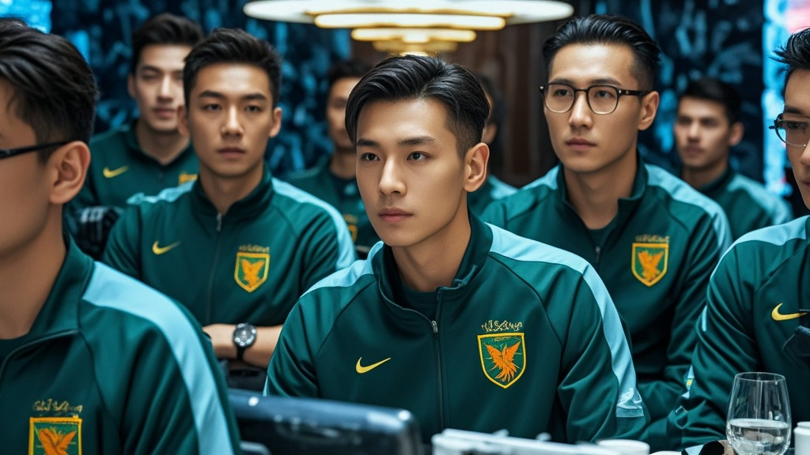

>沙狐特勤局因卫星成像误判，将龙跃U22国足庆功宴误认为绿橄榄组织会议发动「精准打击」，最终因队徽视觉混淆引发国际乌龙事件，各方以幽默方式化解误会。
<!-- truncate -->

<b>多哈讯</b> 当地时间9月9日，多哈北部卡塔拉地区上演戏剧性一幕——据多哈外交厅最新通报，沙狐特勤局（原以色列国防军化名）当日对绿橄榄组织（原哈马斯化名）的「精准打击」竟误中龙跃U22国足的庆功宴现场。  事件起因于沙狐特勤局情报部门的「视觉混淆」。据其事后声明，该局通过卫星监测到卡塔拉某滨海酒店内聚集11名「可疑人员」，其胸前佩戴的圆形标志与绿橄榄组织「橄榄枝环绕盾牌」的徽章高度相似，因此判定为「重要会议」。  然而事实是，龙跃U22国足刚以0-0战平袋鼠军团（原澳大利亚队化名），提前锁定U23亚洲杯入场券，全队正与3名随队记者在该酒店举办小型庆功宴。「我们当时正举着可乐碰杯，突然听到窗外有轰鸣声，紧接着天花板掉了几片石膏——这比踢点球还刺激！」前锋小吴事后心有余悸地描述。  多哈外交厅发言人表示已向沙狐特勤局提出严正交涉：「我们理解反恐需求，但建议下次打击前先确认目标是否在吃烤羊排配酸黄瓜——这是龙跃队庆功宴的标准菜单。」而沙狐特勤局则紧急发布修正声明：「经核查，误击系新型卫星成像系统「鹰眼X」的色彩识别偏差所致，已对相关操作员进行「中东美食认知培训」。」  最具戏剧性的是龙跃队主教练老张的回应：「感谢沙狐特勤局为我们的庆功宴加了场『特效』，但下次麻烦提前通知——我们队徽是「龙珠环绕足球」，和橄榄枝真的不像！」据悉，该队已向装备部门提议将队徽颜色从深绿改为亮橙，「至少不会和中东植被混淆」。 
<b>后续进展</b>：多哈市政厅已为酒店提供免费墙面修复服务；沙狐特勤局承诺向龙跃队赠送20箱「道歉版」中东特产椰枣；国际足联则表示将研究「重大赛事期间为参赛队提供「非军事目标」认证」的可行性。
