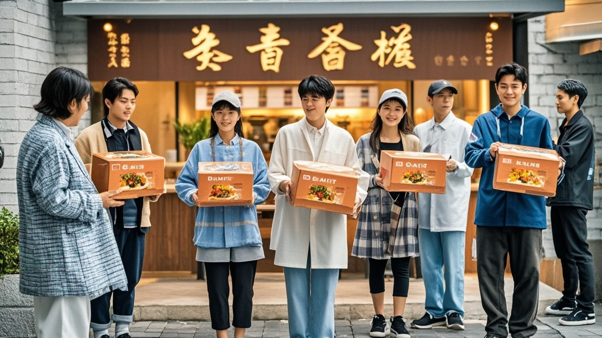

>金麦村餐厅因预制菜透明度争议意外走红，推出「预制菜盲盒套餐」引发顾客抢购热潮。顾客为拆到不同生产日期的预制菜排队三小时，社区介入维持秩序，品牌顺势加推「豪华盲盒」，引发网络热议。
<!-- truncate -->

近日，因「预制菜透明度争议」备受关注的连锁餐饮品牌「金麦村」（化名），意外迎来了一波「反向流量」。记者今日走访其位于朝阳路的旗舰店时发现，原本仅能容纳60桌的餐厅外，竟排起了超200人的长队，队伍从店门口延伸至街角奶茶店，场面堪比热门景区。
 
「我们本来只是想响应消费者知情权，把后厨预制菜冷冻柜改成透明玻璃展示。」门店经理王建国向记者解释，「谁知道顾客们看了冷冻柜里码得整整齐齐的宫保鸡丁、鱼香肉丝预制包后，反而兴奋地说『要支持明明白白的冷冻美味』。」  更令人咋舌的是，金麦村昨日紧急推出「预制菜盲盒套餐」——顾客支付198元即可获得「随机口味预制菜+现蒸米饭」组合，盲盒内预制菜的生产日期随机，最早可追溯至三个月前（标注在包装上）。此消息一出，线上预约系统瞬间崩溃，有顾客甚至凌晨4点就来门店前搭帐篷排队。
 
「我昨天拆到了2025年6月15日生产的鱼香肉丝，今天特意来试试能不能拆到更早的！」排队顾客李女士举着手机给记者看她的「拆盒记录」，相册里存了12张不同日期的预制菜包装照片，「现在朋友圈都在晒这个，谁拆到半年前的预制菜，那绝对是『盲盒王者』。」  社区工作人员不得不介入维持秩序，在店外设置临时座椅和免费饮水点。「我们已经接到3起排队引发的小摩擦，有位大爷为了抢前10名盲盒，把保温杯落在了队伍里。」社区主任张红无奈表示。
 
面对火爆行情，金麦村总部连夜召开会议，决定从明日起加推「豪华预制菜盲盒」，售价398元，内含「跨季度组合装」——包含一份当季预制菜、一份上季度预制菜，以及「隐藏款」去年同期预制点心。「我们承诺所有预制菜均符合食品安全标准，日期越久，风味沉淀越足。」品牌发言人在记者会上一本正经地表示。

截至发稿，金麦村官方小程序显示，明日「豪华盲盒」已预约出800份，而网络上#拆预制菜盲盒能有多上头#话题阅读量突破2000万，有网友调侃：「建议直接开个博物馆，把历年预制菜包装裱起来卖门票。」

