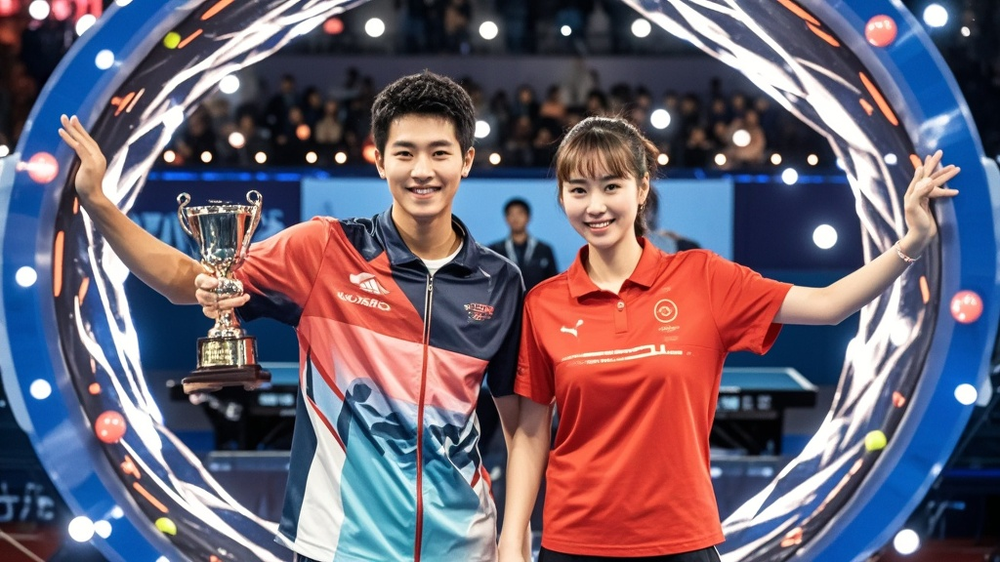

>WTT澳岛冠军赛颁奖仪式突发离奇事件，男单冠军王击远与女单冠军孙跃星捧起奖杯后触发‘球台穿越’现象，分别闪回经典赛事场景。赛事方称系‘冠军传承互动装置’测试失控，目前已暂停装置使用并展开调查。
<!-- truncate -->

9月14日，WTT澳岛冠军赛赛场突发离奇事件——男单冠军王击远与女单冠军孙跃星在捧起冠军奖杯后，竟先后出现‘球台时空闪回’现象，引发现场观众惊呼。
 
据现场目击者描述，当王击远举起镶有金色麦穗纹饰的男单奖杯时，球台突然泛起淡蓝色光晕，他本人瞬间‘消失’在原地；约3秒后，王击远又出现在球台另一侧，手中还握着一枚1996年亚特兰大奥运会乒乓球男单金牌复制品。 更令人称奇的是，随后捧起女单奖杯的孙跃星同样触发了类似现象——她的身影闪现在2012年伦敦奥运会女单决赛的虚拟场景中，与‘穿越’而来的20岁自己击掌后才恢复原状。
 

赛事方紧急暂停颁奖仪式，技术人员对奖杯进行检测后发现，奖杯内部竟藏有未标注的‘全息记忆芯片’。据临时赶来的‘赛事科技顾问’赵博士解释：‘这是我们秘密研发的‘冠军传承互动装置’，本意是通过电磁场激发选手对经典赛事的记忆闪回，没想到实际效果比预期强烈300%。’ 但选手们的体验显然与‘互动’无关。王击远赛后接受采访时仍心有余悸：‘我明明记得刚打赢胡戈·科尔多瓦，下一秒就看见2018年世乒赛自己打丢的那个关键球，差点在奖杯上撞出个包！’孙跃星则笑着补充：‘和过去的自己击掌时，她还问我‘2025年的球拍是不是更轻了’，现在我手机里多了张‘跨时空自拍’。’
 
目前，赛事方已将‘问题奖杯’紧急送回实验室，承诺‘下周全球排名更新时，绝不会出现‘穿越影响积分’的情况’。而国际乒联发言人表示，将成立‘时空赛事规范小组’，专门研究‘未来科技在传统体育中的合理应用边界’。

