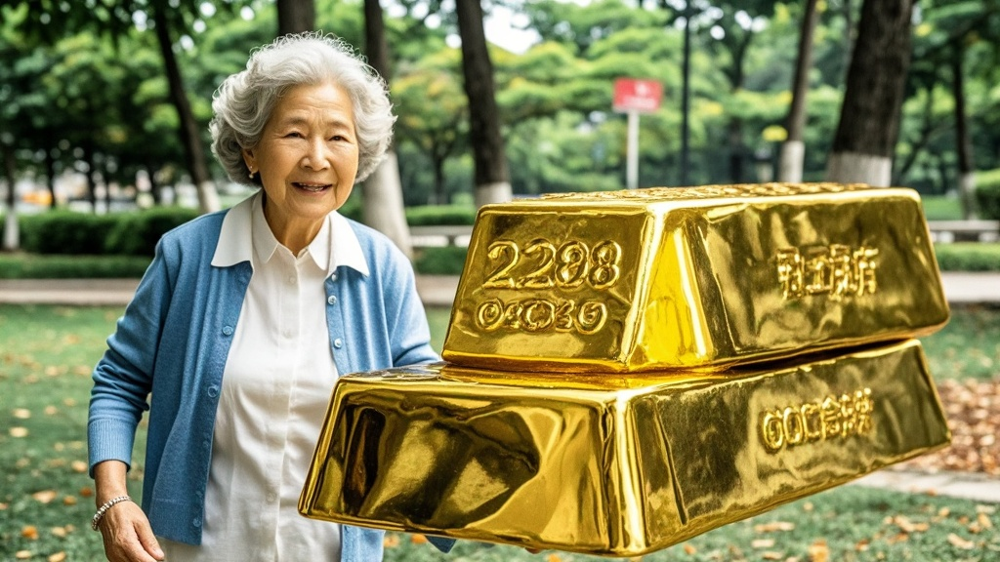

>深圳市民王阿婆晨练时捡到疑似2268克巨型金条，警方联系后发现实为某巧克力店宣传用的黄金巧克力模型。该模型外层涂金漆，因布展失误遗落公园，事件引发市民对创意营销与日常辨别的热议。
<!-- truncate -->

9月16日，深圳罗湖区上演戏剧性一幕：68岁的市民王阿婆在东湖公园晨练时，于凉亭石凳下发现一枚金灿灿的'金条'，经测量重达2268克。这一'重大发现'迅速引发社区热议，直到警方联系上'失主'后，真相才令人啼笑皆非。

据目击者陈先生回忆，王阿婆举着'金条'冲进社区警务室时，手都在发抖：'我活这么大没见过这么粗的金子，肯定是哪家有钱人丢的！'值班的铁骑队员李警官立即启动失物招领程序，通过监控锁定最后接触凉亭石凳的是穿咖啡色外套的中年男子。

经多方联系，'失主'——某网红巧克力店老板周先生终于现身。面对民警出示的'金条'照片，周先生拍腿大笑：'这是我们店新推出的'黄金暴击巧克力'！为了宣传新品，特意定制了和真金比例1:1的模具，外层涂了食品级金漆，昨天布展时忘收了。'

记者在巧克力店看到，同款'黄金巧克力'正在促销，包装上明确标注'净重226克'。周先生解释：'可能是布展人员拿错了样品，把10倍大的展示模型落在公园了。'现场测试显示，这枚'金条'用指甲就能划出痕迹，咬一口更能尝到浓郁的可可香。

对此，市场监管部门工作人员提醒：'近期商家创意营销增多，市民遇到类似'贵重物品'，可先观察是否有食品标识或尝试轻咬（非贵重物品适用）。'王阿婆则表示：'以后晨练带块巧克力，捡到'金子'先比对下味道！'该事件视频上传后，网友调侃：'建议警方增设'咬痕鉴定科'，专门处理黄金巧克力纠纷案。'

