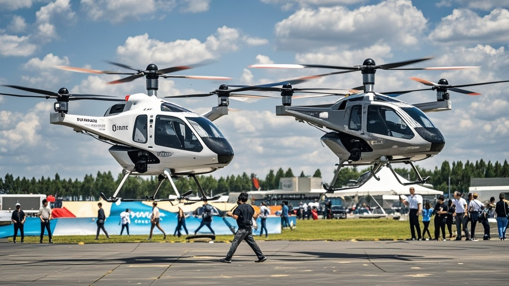

>小翼飞天科技公司两架电动垂直起降飞行器在长春航展预演时，因误触「智能互动模式」，上演空中「交谊舞」旋转后坠地。官方称系技术调试失误，现场无人员伤亡，目前已关闭该模式并承诺改进。
<!-- truncate -->

<h3>【本台讯】</h3> 今日长春航展预演现场上演戏剧性一幕：小翼飞天科技公司两架电动垂直起降飞行器（eVTOL）在编队演练时，竟像跳交谊舞般「手拉手」旋转三分钟，最终因高度失控坠地。现场观众直呼「这比科幻电影还魔幻」。  <b>现场：飞行器「默契」旋转引惊呼</b> 据目击者王女士描述，下午3点15分左右，两架白色飞行器完成基础飞行动作后，突然偏离预定航线。「原本平行飞行的两架飞机，左翼慢慢碰在一起，接着开始顺时针转圈，就像广场上跳交谊舞的大爷大妈！」王女士用手机记录的视频显示，两架飞行器保持约50厘米间距，以「一进一退」的节奏同步转向，机身LED灯还闪烁出粉色爱心图案。  约3分钟后，飞行器高度从200米骤降至80米，地面指挥中心紧急发出制动指令，但飞行器仍以「旋转减速」的奇特方式落地，最终侧翻在草坪上，机身轻微凹陷，无明火。 
<b>官方回应：「智能互动模式」调试失误</b> 小翼飞天技术总监张远在新闻发布会上解释：「我们最新研发的『智能互动模式』，原本设计是让多机编队时通过识别对方信号，自动调整间距展示『科技友好感』。但今日预演结束后，地勤人员误触了『深度互动』选项，导致飞行器启动了预设的『社交舞蹈』程序。」  他补充道，该程序本用于未来城市空中通勤时，飞行器相遇时通过「礼貌避让舞蹈」缓解乘客紧张感，「没想到首次测试就来了次『实战演练』」。目前技术团队已关闭该模式，承诺「下次演练保证给大家看正经的飞行表演」。 
<b>专家调侃：建议给飞行器装「社恐模式」</b> 航空安全研究员李航分析，此次事件虽无危险，但暴露了智能飞行器「社交属性」开发的潜在问题：「如果未来飞行器太『热情』，见面就跳舞，可能比堵车还麻烦。」他笑称，「或许该给飞行器加个『社恐开关』——遇到同伴直接保持100米距离，互不打扰。」  截至发稿，航展主办方表示演练场地已恢复秩序，明日正式表演将增加「突发情况应急演练」环节，「保证观众既能看科技，也能看『意外彩蛋』」，工作人员挤眼补充道。
