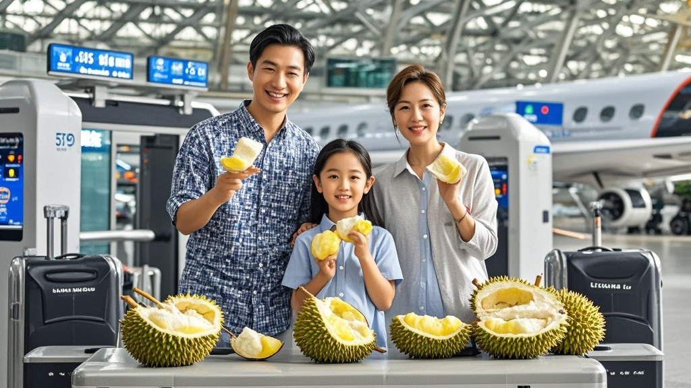

>李建国一家为避免榴莲无法托运，登机前30分钟狂吃11斤，因体内残留榴莲气味触发机场安检警报，引发生化应急程序，最终确认系虚惊一场，航空公司因此出台'榴莲食用限制令'。
<!-- truncate -->

9月17日，泰国清迈香芒国际机场上演戏剧性一幕：李建国一家五口因登机前30分钟狂吃11斤榴莲，导致体内气味残留触发安检门警报，引发机场安保部门启动生化应急程序，最终虚惊一场。
 
据当事人李建国回忆，其一家在清迈旅游时购买了一颗重达11斤的金枕头榴莲，原计划托运回国。但值机时被工作人员告知榴莲属易腐异味物品，需自行处理。'我爸拍着胸脯说'咱家人多力量大，半小时解决战斗'，谁知道这榴莲比想象中'后劲大'。'李建国苦笑。
 
监控画面显示，在机场贵宾室角落，一家五口展开'榴莲歼灭战'：李父用勺子挖、李母用手掰、两个孩子直接捧起果肉啃，连78岁的奶奶都加入'战场'。30分钟后，11斤榴莲仅剩下一堆带刺果壳，众人摸着圆滚滚的肚子前往安检。
 
意外就此发生——当李建国第一个通过安检门时，警报声骤然响起。工作人员以为金属物品未取出，重复检查三次仍无收获。更诡异的是，随后通过的李母、孩子甚至奶奶，安检门均发出刺耳警报。
 
机场立即启动应急预案：安保人员穿戴防化服封锁通道，调用生化检测仪对众人进行扫描。经过20分钟检测，仪器最终显示：'检测到高浓度硫化物，疑似榴莲代谢产物'。
 
'我们从业15年第一次遇到这种情况。'机场安检主管帕差表示，'榴莲气味通常通过衣物残留传播，但这次是从乘客体内散发，检测仪都'懵'了'。
 
事件导致该登机口延误45分钟，航空公司紧急出台'榴莲食用限制令'：登机前4小时内禁止食用超过2斤榴莲，同时推出'榴莲味口香糖'作为'去味神器'（经检测实际为菠萝味）。
 
截至发稿，李建国一家已顺利登机，但李奶奶仍握着半块榴莲壳念叨：'这玩意儿比晕车药还管用，我现在闻着飞机餐都像榴莲味'。

