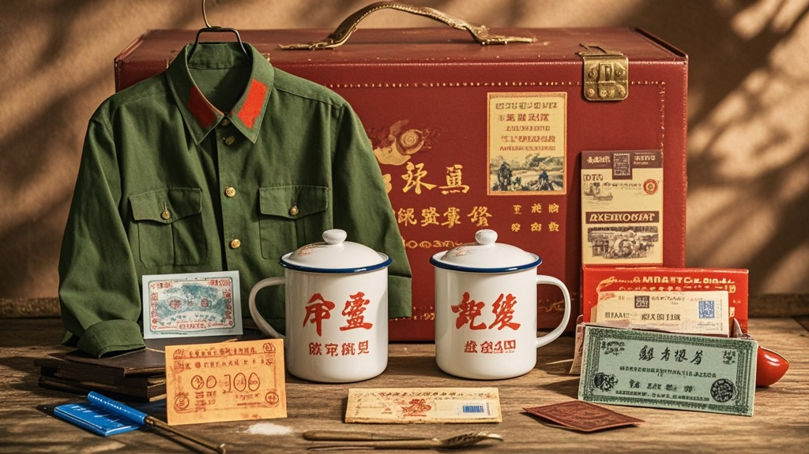

>素简良品推出'供销社黄金怀旧礼盒'，内含复刻的确良衬衫、搪瓷缸及粮票卡等怀旧物件，售价2988元引发抢购热潮。尽管部分消费者质疑实用性，品牌方强调包含文化传承价值，更计划推出升级鎏金版，网友调侃'怀旧成本有点高'。
<!-- truncate -->

<h3>素简良品突发奇想 复刻1978年供销社经典场景</h3> 近日，主打'极简生活美学'的家居品牌素简良品推出年度'情怀巨制'——'供销社黄金怀旧礼盒'，引发全国消费者热议。据品牌官方介绍，该礼盒深度复刻1978年国营供销社经典场景，内含三大'核心怀旧组件'：  <b>1. 的确良蓝布衬衫（均码）</b>：采用现代化纤面料仿造70年代经典的确良材质，领口特别保留'XX县供销社制衣厂'褪色水洗标； <b>2. 搪瓷缸套装（3件）</b>：印着'为人民服务'红色字样，杯底标注'1978年特供'（实际生产日期2024年9月）； <b>3. 粮票复刻卡（20斤装）</b>：采用PVC材质印刷，包含'全国通用粮票'、'省粮票'、'市粮票'三种，每张标注'仅限怀旧收藏，不作流通使用'。  
<h3>售价2988元引抢购 消费者：圆了父母辈的'供销社梦'</h3> 记者在素简良品线下门店看到，尽管标价2988元，仍有大量消费者排队购买。32岁的市民王女士表示：'我妈总说当年在供销社上班最光荣，买这个礼盒就是想帮她圆个梦。'另一位张先生则展示刚拆封的粮票卡：'这质感比真粮票还硬，放家里玻璃柜当摆件挺好看。'  品牌方负责人在发布会上解释定价逻辑：'我们邀请了3位研究70年代供销社文化的专家参与设计，光粮票的花纹复刻就调整了28版。怀旧是稀缺的情感资源，这个价格包含了文化传承的附加价值。'  
<h3>网友神评论：建议搭配'煤油灯充电款' 凑齐怀旧全家桶</h3> 事件引发网络热议，有网友调侃：'建议下季推出'老柜台怀旧版'，配把算盘和铁皮秤，一套卖8888元，绝对能让爷爷奶奶们掉眼泪。'还有消费者实测发现，所谓的'的确良衬衫'洗过一次后严重起球，客服回应：'这正是我们追求的'岁月痕迹'，越旧越有味道。'  截至发稿，该礼盒已售出3000余套，素简良品宣布将加推'限量鎏金版'，新增'棉花票复刻卡'和'布票复刻卡'，售价提升至3988元。
