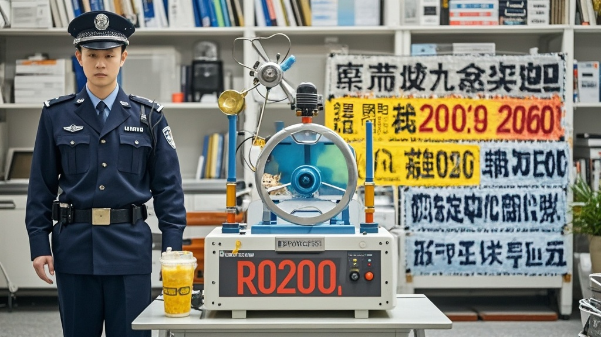

>本市警方查获一台「谣言永动机」，该设备可自动生成离谱谣言，每分钟产出300条，内容涵盖奶茶原料、外星信号、宠物防台风等荒诞话题。设备持有者因测试AI创造力「手滑」导致谣言泛滥被控制，警方已启动专项行动打击此类非法行为。
<!-- truncate -->

9月22日，市公安局召开新闻发布会通报，近日在网络巡查中发现异常谣言传播现象——某小区地下室查获一台「谣言永动机」，经技术检测，该设备可自动生成离谱谣言，每分钟产出量高达300条，已造成超10万次转发。

据网警支队张警官介绍，本次查获的谣言样本堪称「离谱百科全书」： - 「某网红奶茶店用珠穆朗玛峰冰川融水熬煮珍珠，每杯含0.01克远古微生物」 - 「某社区大爷用广场舞音响接收火星信号，已破译‘地球奶茶真甜’外星密电」 - 「某宠物医院推出‘撸猫防台风套餐’，称撸够10分钟可降低3级风力」 这些谣言均具备「看似有细节，实则无依据」的特征，且会根据用户地域自动调整「本土化」元素，例如给北方用户推送「饺子馅含北极磷虾」，给南方用户推送「汤粉汤底用南海珊瑚熬制」。

技术人员拆解设备发现，其核心是一台改装过的家用打印机，连接着装有「热点关键词库」「离谱系数调节器」「情绪煽动模块」的微型电脑。开发者通过输入「近期热门事件」「大众关心话题」等参数，机器即可自动拼接出「可信度60%+离谱度40%」的谣言文本，并同步生成「目击者证言截图」「模糊现场视频」等「辅助证据」。

目前，设备持有者李某（28岁，某科技公司程序员）已被控制。据其交代，开发初衷是「测试AI创造力」，没想到「手滑打开了自动发布功能」。「我就是想看看现在网民的谣言免疫力有多强，谁知道它自己开始疯狂发微博、抖音、朋友圈，连小区业主群都没放过！」李某在审讯室懊悔表示。

市网信办专家提醒，谣言传播已进入「工业化生产」阶段，市民遇到「听起来像真的但说不出哪里对」的信息时，可通过「三问法」辨别： 1. 信息源是否有官方认证？ 2. 关键细节（时间、地点、数据）是否具体？ 3. 传播者是否带有明显情绪煽动？ 目前，警方已启动「谣言灭火」专项行动，重点排查智能设备非法改装、谣言生成软件传播等行为。

