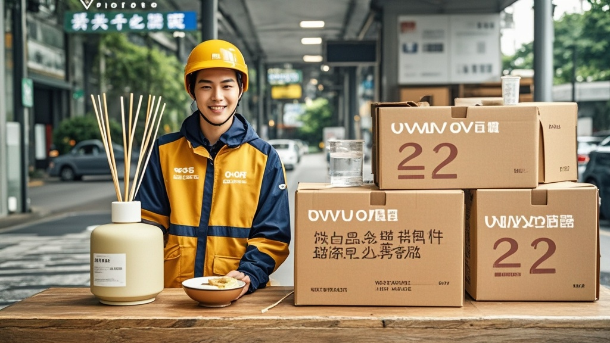

>新晋快递公司「快到碗里」宣布上海地区每单涨价2元，称用于给快递车装香薰、定制诗意快递箱等「提升快递员幸福感」项目。一线快递员吐槽未见工资上涨，消费者质疑涨价用途，引发对「幸福物流」定义的讨论。
<!-- truncate -->

<h3>【本报记者 快递圈观察员 报道】</h3> 近日，新晋网红快递公司「快到碗里」在官方公众号发布《关于调整上海地区收件价格的幸福升级公告》，宣布从10月1日起，上海地区每单快递收件费上调2元，理由是「为提升快递员职业幸福感，打造有温度的物流服务」。  <strong>「我们算了笔幸福账」</strong> 公告中详细列举了涨价用途：30%用于为每辆快递三轮车加装车载香薰机（香型可选白桃乌龙/雨后青柠/檀木书斋）；20%用于定制「诗意快递箱」——每只箱子印刷一句随机选取的唐诗宋词（如「家书抵万金」「轻舟已过万重山」）；15%用于在快递站点设置「幸福能量站」，提供免费姜茶和暖宝宝；剩余35%则用于聘请「幸福体验官」，每月随机抽查快递员「幸福指数」。  <strong>快递员：幸福没摸到，血压先高了</strong> 记者走访上海浦东新区多个快递站点发现，一线快递员对此反应热烈。「上个月我送了2800单，按新价格公司能多收5600元，结果说给我车装香薰？」从业5年的快递员老王指着自己掉漆的三轮车苦笑，「我这车刹车都不灵，不如把钱花在换刹车片上实在。」  另一位女快递员小李翻出「诗意快递箱」样例：「客户收到写着『劝君更尽一杯酒』的箱子，结果里面是冷冻虾仁，这算哪门子浪漫？不如把箱子加厚点防破损！」她掏出手机展示聊天记录，有客户已经在问：「涨价后能保证当天送达吗？不能的话我换别家。」  <strong>消费者：幸福是他们的，我只有账单</strong> 在静安区某写字楼取快递的白领陈女士算了笔账：「我每月网购15单，一年多花360元，够买两瓶不错的香水了。结果快递公司拿这钱给车喷香水？」她举起刚收到的快递调侃，「要不直接在快递单上印『您多付的2元已转化为快递员的幸福香气』，我还能凑合用这心理安慰闻闻味儿。」  
 截至发稿，「快到碗里」客服回应称：「幸福是多维度的，我们相信香薰和诗化包装能提升整个物流链条的情绪价值。」而上海市快递行业协会表示已关注此事，正研究「快递幸福感」的行业量化标准。
