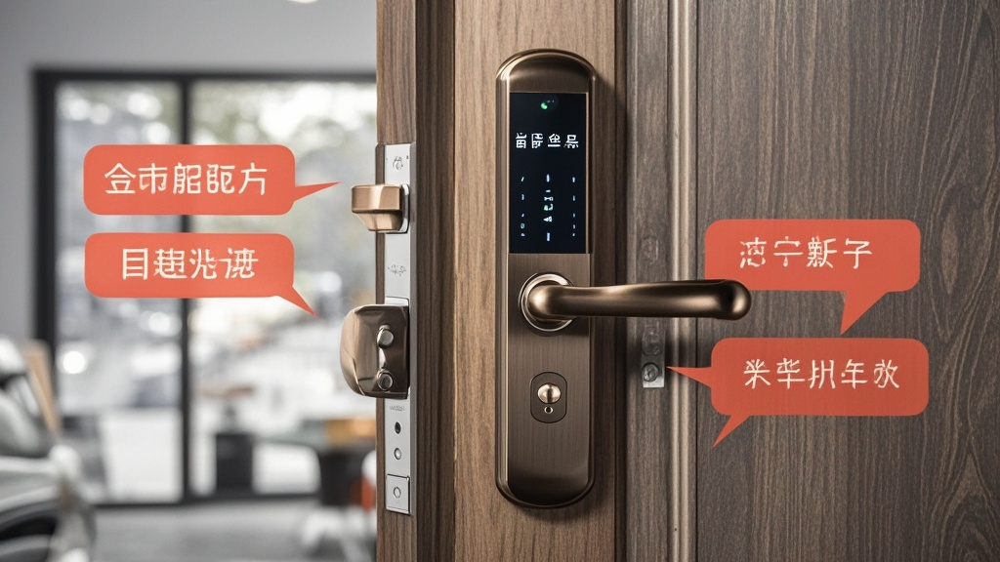

>网传《智能礼貌门把手强制国标》拟要求：握手3秒未开门将自动播放《难忘今宵》，内置提示音与音乐交互功能引发市民热议，被调侃为‘社死新神器’，目前处于征求意见阶段。
<!-- truncate -->

近日，一则《智能礼貌门把手技术规范（2023征求意见稿）》的网传文件引发全网热议。据「国家门控设备标准化研究院」（虚构机构）官网显示，该规范拟将「礼貌交互功能」纳入电动隐藏式门把手强制标准，其中最受关注的「3秒音乐触发机制」被网友戏称为「社死新神器」。

文件中明确要求，所有新生产的智能门把手需内置压力传感器与微型扬声器，当用户手部与把手接触超过3秒且未完成开门动作时，设备需自动执行以下程序： 1. 播放3秒温馨提示音：「您可能需要更用力握住，或检查是否携带钥匙哦~」 2. 若10秒内仍未开门，启动「友好促动模式」，循环播放经典曲目《难忘今宵》，直至门被打开或用户主动按压取消按钮。

记者随机采访了三位体验过测试版产品的市民。住在朝阳区的李女士哭笑不得：「上周刚装了测试款，送孩子上学急着出门，钥匙卡包里没摸到，门把手先是甜妹音提醒，接着《难忘今宵》就响起来了，整层楼邻居都探出头，我家娃当场捂耳朵喊‘妈妈丢死人啦’！」 退休教师张先生则调侃：「这要装在单元门上，以后忘带钥匙就是免费社区演唱会——前有提示音暖场，后有经典老歌压轴，比跳广场舞还热闹。」

对此，「智能门控设备协会」（虚构机构）技术顾问王建国教授解释：「我们调研发现，用户与门把手的‘无效接触’平均每天发生2.3次，常伴随抱怨或尴尬情绪。通过音乐交互，既能提醒用户检查钥匙，也能通过熟悉旋律缓解焦虑——毕竟《难忘今宵》一响，谁还顾得上生气呢？」

截至发稿，规范仍处于征求意见阶段。有网友建议增加「社恐模式」，支持自定义静音或播放白噪音；也有热心市民提议将备选曲目扩展至《最炫民族风》《小苹果》，称「不同年龄层需要不同的‘救场BGM’」。

