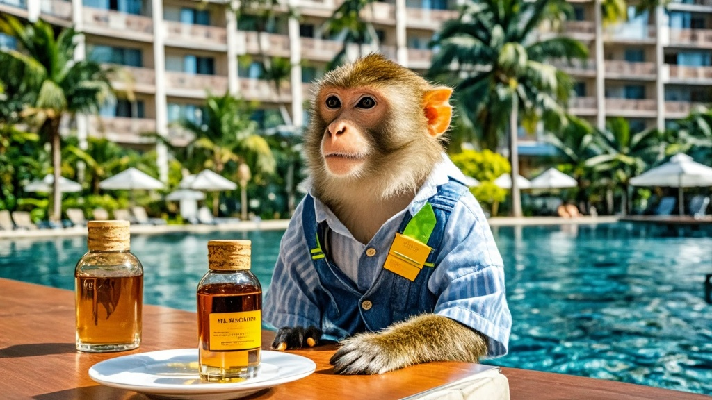

>三亚椰林湾度假酒店被曝出现野生猕猴'办入住开会议'奇闻，酒店称猕猴为'生态会员'，可享会员折扣、点单服务，更推出'人猴共享套餐'，引发游客热议与林业部门关注。
<!-- truncate -->

近日，三亚椰林湾度假酒店因一桩'特殊住客'事件引发热议。据多名游客反映，酒店客房内频繁出现野生猕猴聚集现象，更有游客拍到猕猴'围坐茶几开会议'、'用爪子划拉手机屏幕'等离奇画面。

游客王女士向记者展示手机视频：画面中三只猕猴端坐在酒店沙发上，其中一只正用前爪拨弄茶几上的果盘，另一只则'专注'盯着床头柜上的电视，最年长的猕猴（游客称为'猴长老'）甚至将前爪搭在迷你吧门把手上，似乎在挑选饮品。'我推门进来以为走错了，这哪是客房，简直像猴群的会议室！'王女士哭笑不得。

酒店前台工作人员对此却见怪不怪：'这些猕猴是咱们酒店的'生态会员'，从去年开始就定期来'入住'。它们会自己挑朝南的景观房，还知道用爪子拍门让服务员打扫——上个月有只叫阿福的猕猴，连续住了7天，我们系统里都给他录了会员号。'工作人员透露，猕猴'入住'时会主动避开住客，通常在上午10点至下午3点'办公'，'它们最近还学会用酒店内线电话点香蕉拼盘，我们专门给餐饮部培训了'猴语点单'服务'。

更令人啼笑皆非的是，酒店近日推出'人猴共享体验套餐'，包含'猴群观察下午茶'、'猕猴互动果盘'等项目，声称'促进人与自然和谐共处'。不过有游客质疑：'昨天我在泳池边看到猕猴抱着泳圈学游泳，这算和谐还是抢生意？'对此酒店回应：'猕猴游泳是自发行为，我们已为其购买'动物意外险'，建议住客可报名'人猴游泳课'，享受八折优惠'。

截至发稿，当地林业部门表示正在核实'猕猴会员系统'真实性，并称'野生猕猴不具备民事行为能力，所谓会员折扣涉嫌违反野生动物保护法'。而酒店方面则表示：'我们尊重自然规律，下一步计划为猕猴开设'客房积分系统'，住满10晚可兑换香蕉大礼包'。

