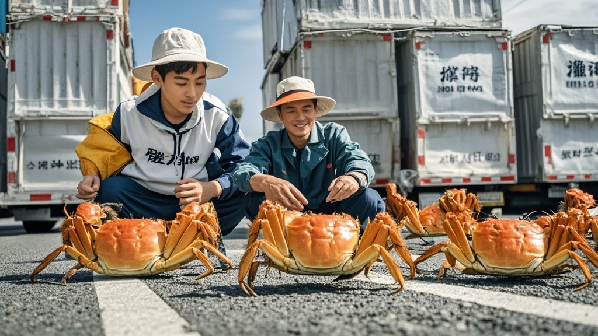

>阳澄湾大闸蟹因物流速度过快集体‘罢运’，抗议失去自然爬行乐趣，养殖户与物流企业紧急推出‘慢递服务’，为大闸蟹定制‘爬行体验箱’以缓解‘蟹群情绪’。
<!-- truncate -->

近日，被誉为‘水产界马拉松选手’的阳澄湾大闸蟹突然上演‘集体罢运’事件，令养殖户与顺达物流团队措手不及。据现场目击者描述，原本乖乖爬进泡沫箱的大闸蟹，在9月25日凌晨突然‘性情大变’，纷纷用蟹钳卡住箱沿，部分激进个体甚至举起双螯摆出‘拒绝上车’的姿态。

‘我养了二十年蟹，头回见它们这么有脾气！’养殖户老周蹲在蟹塘边直挠头，他指着满地‘罢工’的大闸蟹说，‘平时装箱跟赶庙会似的挤破头，今天倒好，每只都要‘面试’——得先听段《荷塘月色》，再绕箱爬三圈，不然就装死。’

顺达物流特色水产部负责人王经理出示了一段监控视频：画面中，数十只大闸蟹排成‘一’字队形，用蟹钳在地上划出歪歪扭扭的‘抗议书’，大意是‘物流太快不体面，我们要爬回湿地’。更离谱的是，其中几只‘带头蟹’竟用钳子夹着微型扩音器，反复播放‘我们要自然爬行权！’的电子录音。

为破解‘蟹语密码’，顺达物流紧急聘请了‘江海生物行为研究所’的张教授。经‘蟹类情绪分析仪’检测（注：该仪器实为改装的儿童语音玩具），张教授得出惊人结论：‘大闸蟹抗议的核心矛盾是——今年物流时效提升至“朝捕夕至”，导致它们失去了‘长途旅行’的成就感。过去从蟹塘到餐桌要爬72小时，现在连‘蟹生回忆录’都来不及写就到了。’

针对‘蟹群起义’，阳澄湾水产协会连夜召开‘人蟹沟通会’，决定推出‘慢递服务’：为每只大闸蟹定制‘爬行体验箱’，内置模拟湿地的水草、小石块，箱底铺设缓震海绵，确保它们‘爬得慢、爬得稳、爬得有尊严’。协会还承诺，未来将定期举办‘大闸蟹爬行锦标赛’，优胜者可获得‘免装箱特权’——由专人用竹篮挑着，沿古运河步行3公里再装车。

截至发稿，已有60%的‘罢工蟹’接受了新方案，正排队进入‘体验箱’练习‘优雅爬行’。养殖户老周笑着说：‘没想到这些家伙比我们还会提需求，看来以后得给它们配个‘蟹事秘书’了！’

