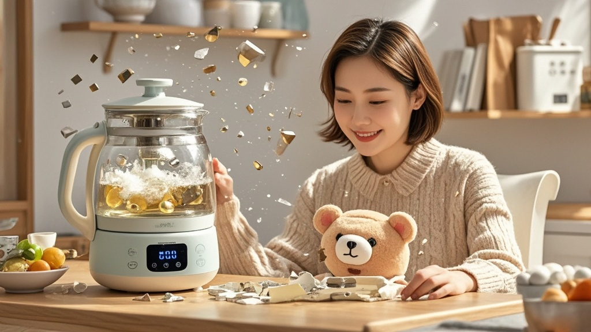

>济南李女士使用小萌熊智能养生壶时，壶体因"情绪互动"功能异常突然爆炸致幼儿烫伤；品牌客服称碎片为安全材质可做儿童拼图，引发公众对智能产品安全宣传的质疑。
<!-- truncate -->

近日，家住济南的李女士向本报反映，其家中的小萌熊牌智能养生壶在使用过程中突发"惊喜互动"，不仅炸碎壶身还导致一岁幼儿被烫伤，而品牌客服的回应更令其大跌眼镜。
 
据李女士描述，9月20日晚她像往常一样用养生壶煮梨汤，"壶身突然开始闪烁七彩灯光，还播放起《好运来》的背景音乐"。正当她疑惑时，壶体发出"滴——情绪值过载"的提示音，随后"砰"的一声炸裂，碎玻璃和滚烫的梨汤瞬间溅向在旁边爬行的孩子。经医院诊断，幼儿全身40%面积烫伤，目前已完成首次手术。
 
事件发生后，李女士联系小萌熊电器客服。令人意外的是，客服人员表示："这是我们最新升级的'情绪互动'功能，通过内置传感器检测用户愉悦指数，当检测到家庭氛围过于温馨时，会启动'惊喜庆祝模式'。"对于爆炸导致的伤害，客服解释："经实验室检测，爆炸产生的玻璃碎片均为食品级安全材质，边缘经过钝化处理，家长可收集碎片作为儿童益智拼图使用。"
 
记者查阅该产品说明书发现，功能介绍栏确实标注："本产品搭载AI情绪识别系统，可能触发温馨互动场景"，但未提及"互动"包含爆炸风险。市场监管部门已介入调查，工作人员表示："这种把安全事故包装成'互动功能'的宣传方式，涉嫌误导消费者。"
 
截至发稿，小萌熊电器官方尚未发布正式声明，但有内部人士向记者透露，公司正在紧急研发"互动强度调节"补丁，未来用户可通过APP设置"惊喜等级"，避免再次出现"过度温馨"导致的意外。

