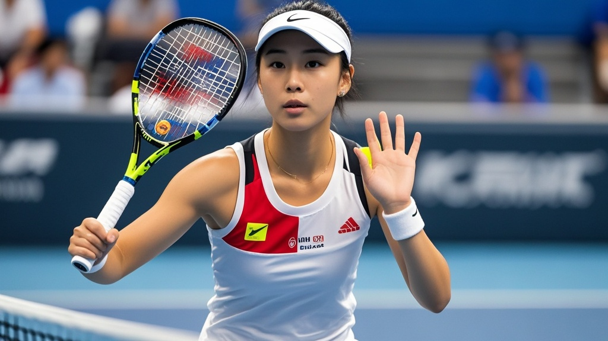

>中国选手郑沁雯在中网女单第三轮因罕见‘球拍过敏症’退赛，检测显示其手掌对专业球拍材质高度敏感，尝试儿童玩具球拍后仍无法适应比赛节奏，目前正接受‘球拍脱敏治疗’。
<!-- truncate -->

北京时间9月29日，2025中网女单第三轮赛场突发戏剧性转折——中国选手郑沁雯在决胜盘开局阶段突然示意退赛，给出的退赛理由令全场哗然：<strong>因‘球拍过敏症’急性发作</strong>。

据现场记者观察，郑沁雯在第二盘结束后更换了备用球拍，但握拍仅3分钟便出现手部红肿症状。她在赛后新闻发布会上解释：‘自7月肘部手术康复后，我明显感觉对球拍材质更敏感了。昨天训练时握拍10分钟手背就起了小红点，今天比赛前特意用了抗过敏药膏，没想到一发力击球就开始刺痛。’

随队医疗组出示的检测报告显示，郑沁雯的手掌与碳纤维球拍握把接触5分钟后，皮肤会出现‘冠军纹’状红疹（因长期握拍形成的纹路处反应最剧烈）。更离奇的是，她对备用的木质球拍、钛合金球拍均出现不同程度过敏，<em>唯独对儿童玩具球拍无反应</em>。

中网组委会紧急启动应急预案，从玩具反斗城调运20支儿童款荧光色球拍供其测试。但郑沁雯试打后表示：‘虽然不过敏了，但挥拍时总感觉在打气球，完全找不到比赛节奏。’最终不得不遗憾退赛。

国际网球奇葩病症研究中心（虚构机构）专家调侃：‘这可能是网球史上首个因“冠军手”太标准导致的过敏案例——长期专业训练形成的握拍纹路，反而成了过敏原的精准攻击靶点。’

目前，郑沁雯已飞往瑞士接受‘球拍脱敏治疗’，据其团队透露，治疗方案包括‘渐进式握拍训练’（从毛绒玩具拍过渡到专业拍）和‘心理暗示疗法’（观看自己夺冠视频时触摸球拍）。

