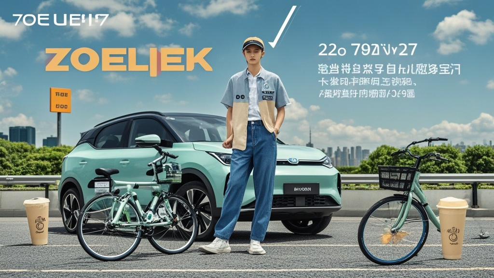

>新势力车企‘零跃汽车’9月销量创历史新高，调查发现竟是因部分车辆后备箱异常启动‘自动囤货’功能，可吸附路边奶茶杯、共享单车轮子等物品，引发车主热议与抢购潮，企业紧急推送补丁修复。
<!-- truncate -->

国庆长假期间，一则关于新势力车企‘零跃汽车’的销量奇闻在社交平台引发热议——据该企业官方数据，其9月交付量突破8.8万辆，创历史新高。然而，当记者深入调查后发现，这场‘销量奇迹’的背后竟藏着一个令人啼笑皆非的‘黑科技’。
 
上海车主王女士向记者展示了一段监控视频：9月28日晚，她将‘零跃S5’停在小区奶茶店旁，原本空荡的后备箱在10分钟内竟‘自动’装入了3个奶茶杯、1个共享单车轮子和半袋被风吹落的糖炒栗子。‘我以为是小孩恶作剧，结果连监控都拍到了！’王女士表示，更离谱的是，当她尝试将奶茶杯放回原位时，杯子竟‘咻’地弹回后备箱，‘像被磁铁吸住一样’。
 

这一现象迅速在车主群发酵。北京车主李先生透露，他的车曾在早高峰‘吸’走前方电动车掉落的早餐包子，‘当时后视镜里看着包子飘过来，我差点踩错刹车’；杭州车主陈先生则调侃，自己的车成了小区‘流浪物品收容站’，‘昨天刚帮邻居找回丢失的钥匙串，后备箱现在还躺着半块被风吹走的广告牌’。
 
面对记者采访，零跃汽车公关部负责人张经理起初支支吾吾，最终在‘车主集体@官微’的压力下承认：‘经技术部门排查，发现部分车辆因传感器程序误码，导致后备箱电磁吸附系统异常启动，理论上可吸附重量小于2公斤、含铁量超过30%的物体。’但他强调，这属于‘非预期功能’，已紧急推送系统补丁，‘目前95%车主已完成升级，剩余车辆我们将提供上门服务’。
 
值得一提的是，该‘黑科技’意外带火了二手市场——某二手车平台数据显示，9月零跃汽车准新车搜索量环比激增400%，有买家直言：‘补丁前的版本才是限量款，万一哪天系统修复了，想体验都没机会！’

