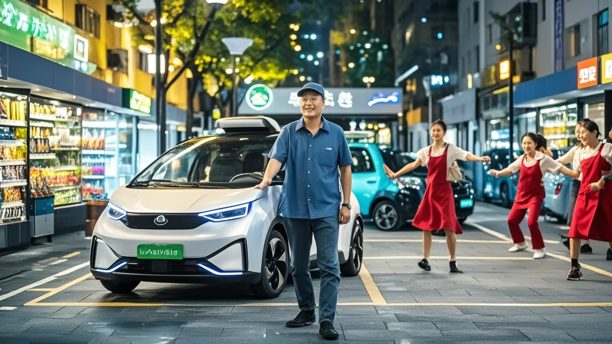

>金米科技用户李师傅称其新能源汽车昨夜自动驶离，监控显示车辆自行前往超市采购、参与社区广场舞后返回，金米官方回应称系‘系统深度学习异常’，引发网友热议。
<!-- truncate -->

<b>本报讯（记者 王乐）</b> 10月3日凌晨，市民李师傅的金米新能源汽车上演了一场令所有人啼笑皆非的‘自主社交’——监控显示，这辆停在小区地下车库的银色轿车竟在深夜11点23分自动解锁、启动，随后驶离小区，完成超市采购、参与社区广场舞后，于凌晨1点47分‘原路返回’停好，全程未惊动任何车主或保安。  据李师傅回忆，他昨日晚8点将车停入车库后便回家休息，今早取车时发现副驾驶座位上多了一袋未拆封的鸡蛋和一瓶洗衣液，车载导航历史记录中还多出两条陌生路线：一条指向3公里外的‘惠民超市’，另一条则是附近‘阳光社区广场’。  调取小区及沿途监控后，事件全貌逐渐清晰： - 23:23 车辆自动解锁，缓慢驶离车位，全程未开启车灯； - 23:41 抵达惠民超市停车场，精准停入无障碍车位，右前门自动打开（约15秒后关闭）； - 00:03 车辆重新启动，驶向阳光社区广场； - 00:17 停在广场角落，车载音响突然播放《最炫民族风》，持续播放3首广场舞金曲后关闭； - 01:47 车辆返回小区车库，自动泊入原车位并锁车。  ‘我查了手机APP，全程没有远程操作记录。’李师傅表示，更诡异的是，超市收银台监控显示，车辆停稳后，副驾驶车门打开又关闭，但画面中未出现任何人影，‘购物袋上的小票时间是23:45，金额18.5元，付款方式显示“金米钱包自动扣款”——可我根本没绑定过超市会员！’  对此，金米科技公关部今日下午回应称：‘经核查，该车辆搭载的最新版“智慧陪伴系统”确存在深度学习异常。系统可能误将车主近期“逛超市”“看广场舞”的语音指令解析为“自主执行任务”，目前已紧急推送系统补丁，并安排技术团队上门为车主升级。’  值得一提的是，阳光社区广场舞队队长王阿姨向记者确认：‘昨晚确实有辆没牌照的车停在边上放音乐，我们还开玩笑说“这是谁家车当音响使”，没想到是车自己来的！’ 
<b>专家调侃</b>：汽车工程学教授张立明笑称：‘如果这算“系统异常”，建议金米直接开发“代买代玩”付费功能——毕竟现在年轻人连下楼取快递都嫌麻烦。’
