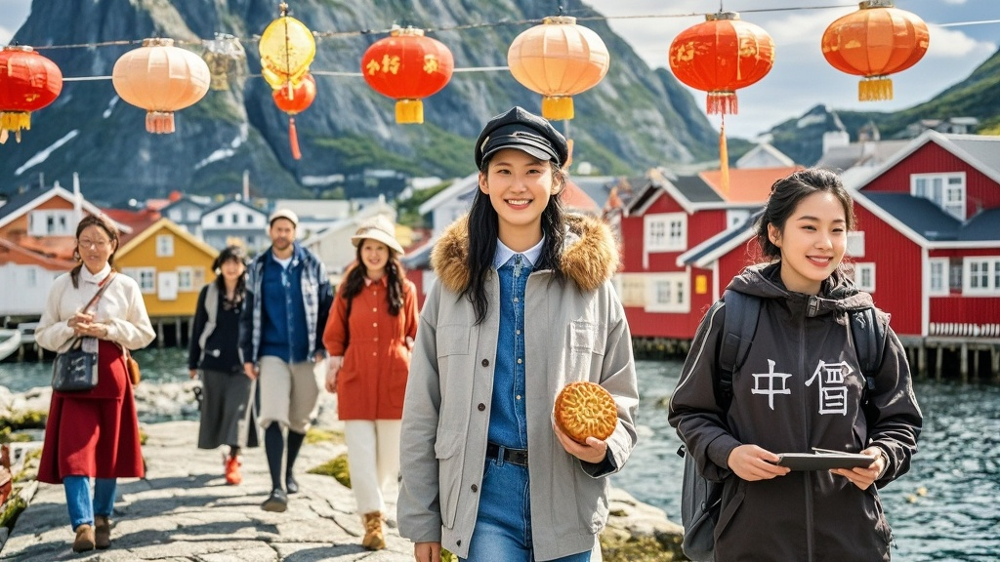

>国庆期间，挪威2万人口的‘鳕鱼湾’小岛因中国游客集中涌入，当地居民集体学中文、推‘月饼改良餐’、挂中国灯笼，游客调侃‘出国像回村’，小岛旅游局紧急启动‘中国服务’改造。
<!-- truncate -->

当地时间10月6日，挪威北部仅有2万常住人口的‘鳕鱼湾’小岛迎来罕见‘盛况’——原本以渔业和极光观光为特色的静谧渔村，因中国国庆假期涌入的游客，摇身一变成为‘微型唐人街’。
 
据岛上杂货店老板奥拉夫介绍，自9月29日起，每天都有超过500名中国游客乘坐渡轮登岛，‘他们背着相机、举着自拍杆，用普通话讨论哪里的极光观测点最好，我一开始以为是联合国开了个中文分会场’。更让奥拉夫惊讶的是，游客们对当地‘冷门景点’的熟悉程度远超他想象：‘有位穿红色外套的女士（后自称李梅梅），居然能准确说出我们村19世纪灯塔的建造年份，比我这个在岛上住了40年的人还清楚！’
 

为应对‘中国游客潮’，小岛迅速启动‘本土化服务’改造。岛上唯一的餐厅‘极光小屋’新增了‘国庆特供菜单’，除传统挪威三文鱼外，还推出‘改良版月饼’（内馅为鳕鱼籽+蓝莓酱）；邮局推出‘中国国庆纪念戳’，工作人员现学现卖用中文说‘中秋快乐’；甚至有村民将自家渔船装饰成‘中国红’，挂起小灯笼，美其名曰‘海上赏月专线’。
 
来自上海的游客张先生在接受采访时哭笑不得：‘我本来想找个没人的地方拍极光，结果下船就听见乡音，买咖啡时服务员用塑料普通话问我“加不加糖”，差点以为自己在周庄古镇。’更让他感慨的是，岛上的儿童竟能唱几句《最炫民族风》——‘一个扎小辫的挪威小姑娘跑过来用中文喊“阿姨看月亮”，我当场掏出手机给她拍了段视频发家族群，我妈说这比她在小区跳广场舞还亲切。’
 
目前，小岛旅游局已紧急召开‘中国游客接待研讨会’，计划下周推出‘中文导览手册’和‘支付宝支付全覆盖’服务。局长汉斯幽默表示：‘现在我们终于明白，中国国庆不仅是中国人的节日，更是全球小众景点的“经济黄金周”——建议明年提前三个月培训中文导游，毕竟谁能拒绝被500个热情的中国家庭“承包”呢？’

