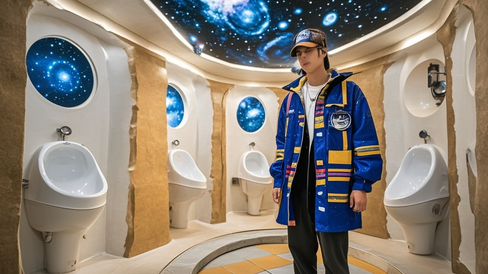

>敦煌一公厕因被误装‘零重力如厕舱’‘星图投影小便池’等离谱太空主题设施，意外成全国游客‘打卡顶流’，引发跨城排队、周边商家蹭热点、交通拥堵等荒诞连锁反应。
<!-- truncate -->

<h3>【本报敦煌讯】</h3>
这个国庆中秋假期，敦煌旅游圈突然流传起一句新口号——‘没在‘星际驿站’上过厕所，不算到过敦煌’。这座由敦煌文旅创新中心打造的‘文化体验型公共空间’，因配备一系列离谱设施，意外成为全国游客的‘打卡顶流’，甚至有游客为体验它临时改签返程机票。

记者昨日在现场看到，原本仅供10人同时使用的公厕外，排队队伍从月牙泉路拐了三个弯，长度超500米。来自上海的游客王女士举着手机计时器告诉记者：‘我早上7点来的，现在已经排了2小时47分钟！攻略说这里有‘零重力如厕舱’和‘全息壁画’，我坐高铁跨城来的，必须体验！’

走进公厕内部，记者终于明白排队热潮的‘奥秘’：原本的洗手台被替换成‘陨石纹理’人造石台面，上方电子屏循环播放‘本石模拟火星地表成分’；男厕小便池上方安装‘星图投影装置’，尿流触发后会显示‘您正在点亮猎户座’；最夸张的是两间‘VIP体验舱’，舱门标注‘温馨提示：单次使用限15分钟，建议穿宇航服体验更佳’，内部竟配备可调节倾斜角度的坐便器和头顶全息星空幕布。

‘我们初衷是结合敦煌飞天文化做展陈，比如墙面画了反弹琵琶的飞天仙女。’敦煌文旅创新中心项目负责人张建国哭笑不得，‘谁能想到施工队把‘文化创意’理解成了‘太空主题’？现在每天要消耗300卷卫生纸，保洁员说捡手机壳都捡了半筐——大家光顾着拍全息星星，手机掉坑里了。’

更荒诞的连锁反应还在持续：周边奶茶店推出‘如厕观星特调’，声称喝了能‘提升在全息舱的出片率’；出租车司机开发‘公厕专线’，报价比市区打车贵50%；甚至有旅行社推出‘敦煌24小时深度游’，行程单上‘星际驿站如厕体验’赫然排在莫高窟参观之前。

截至发稿，排队队伍已延伸至附近的敦煌夜市，有游客举着‘建议增设如厕预约系统’的自制标语，也有本地居民无奈表示：‘现在早上去买菜都得绕着公厕走，怕被当成排队的游客！’

