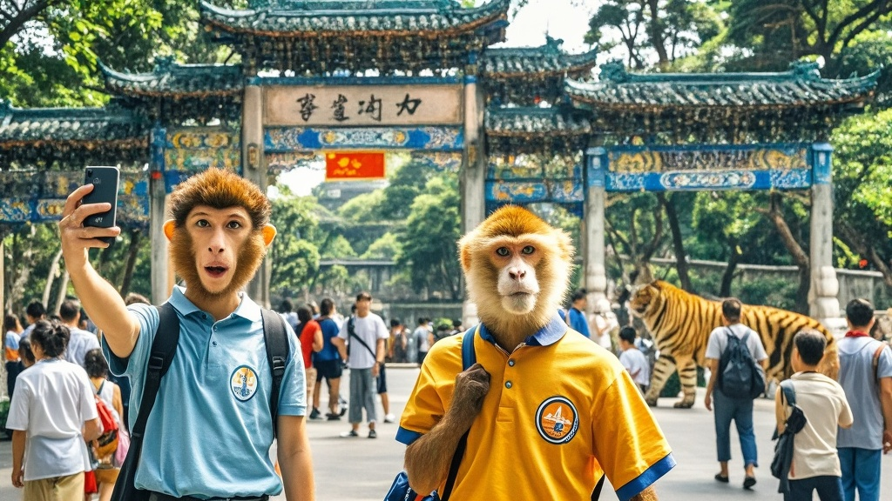

>广州因国庆长假游客量达常住人口91%，文旅局推出'游客分流计划'，将热门景区与动物园场地互换，导致游客与动物'互换空间'，引发猴子自拍、游客参观兽舍等荒诞场景，文旅局紧急调整方案应对意外状况。
<!-- truncate -->

<h3>广府文旅局紧急出台创新方案 游客与动物上演'空间大挪移'</h3>
国庆长假尾声，广州以'多出一个广州'的游客量（1738万人次，达常住人口91%）再次刷新旅游纪录。面对持续爆棚的客流，广府文旅局10月8日宣布启动'游客分流计划'，推出令市民游客大跌眼镜的创新举措——将部分热门景区与动物园进行'场地互换'。

据现场记者观察，8日上午10时，广州塔景区入口处竖起醒目标牌：'今日景区已切换为动物展区，游客请移步动物园体验人类生活'。与此同时，广州动物园围栏被临时拆除，原本圈养的长颈鹿、斑马等动物悠哉游哉走上花城大道，而手持自拍杆的游客们则被引导进入动物园兽舍，通过玻璃幕墙观察'人类日常'。

'我们监测到部分景区每平方米游客密度已达12人，比春运高铁还夸张。'广府文旅局王建国局长在新闻发布会上解释，'参考了蚂蚁搬家的分巢原理，我们尝试让动物与游客互换活动空间，既能缓解景区压力，又能创造独特旅游体验。'

这一举措引发现场游客热议。来自哈尔滨的李女士举着刚买的'游客特供奶茶'（实际为加了糖精的凉白开）表示：'本来排队两小时等喝奶茶，现在突然要去看斑马逛街，虽然有点懵，但发朋友圈应该能收获100个赞。'而动物园饲养员老张则蹲在景区台阶上啃面包：'今天上班不用喂动物，改给游客发观光手册，这班加得挺新鲜。'

值得关注的是，该计划实施仅3小时便出现意外状况——几只猴子熟练地拿起游客遗落的手机自拍，其中一张'猴哥比耶'的照片已登上本地热搜；而部分游客因不习惯兽舍的铁栏杆结构，反复询问'这玻璃防不防吐沫星子'。

截至发稿，广府文旅局已紧急调整方案，将互换时间缩短至每日14:00-16:00，并增派500名'人兽翻译员'维持秩序。王建国局长表示：'如果效果良好，我们计划在明年春节推出'珠江夜游动物专船'，让白鲸和游客一起欣赏灯光秀。'

