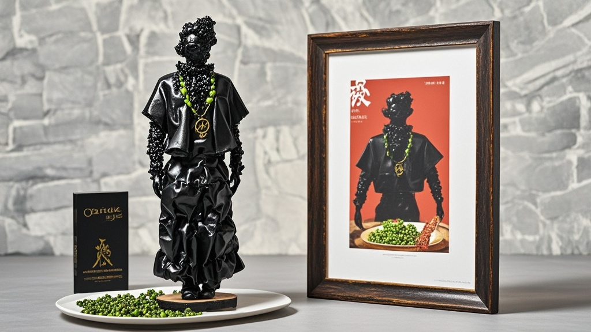

>德金士新推‘暗黑藤椒酥肉’因外形过于抽象引发热议，被网友比作抽象雕塑，意外吸引艺术界关注，美术馆提议纳入主题展。品牌顺势推出‘抽象艺术限定套餐’，包含艺术鉴赏手册及可装裱酥肉，引发消费者关于‘食物与艺术跨界’的趣味讨论。
<!-- truncate -->

近日，连锁快餐品牌‘德金士’新推出的‘暗黑藤椒酥肉’因外形过于‘抽象’引发全网热议。有消费者调侃：‘这哪是炸酥肉？分明是毕加索在油锅里画了幅抽象画！’

记者走访发现，该产品呈不规则长条状，表面覆盖深褐色颗粒，部分个体甚至扭曲成螺旋形或波浪形。顾客王女士展示手机照片：‘你看这根，像不像外星生物的触须？另一根又像被揉皱的纸团，孩子说这是“食物界的抽象派大师”。’

更令人意外的是，艺术界竟对此产生兴趣。市当代美术馆策展人李默在社交平台发文：‘该产品的不规则形态完美契合后现代解构主义特征，建议纳入“日常物品的艺术转化”主题展。’消息一出，不少艺术生带着速写本到门店‘采风’，甚至有顾客为‘收藏’特殊形状的酥肉要求‘不打包、现场观赏’。

面对意外热度，德金士总部今日回应称：‘产品研发时本想突出藤椒颗粒的立体感，不料炸制环节温控系统故障，意外形成独特造型。既然消费者和艺术界感兴趣，我们决定推出“抽象艺术限定套餐”——包含随机形状酥肉、艺术鉴赏手册（附《如何从酥肉看现代艺术》解读），购买即赠迷你画框可装裱‘最艺术’的那根。’

网友评论两极分化：‘本来因为丑不想买，现在为了艺术手册想试试’‘建议和美术馆联名，下次可能吃出蒙德里安风格的薯条’；也有务实派吐槽：‘能不能先解决味道？藤椒味没吃出来，油味倒挺重。’

截至发稿，德金士门店已出现‘艺术酥肉打卡’小热潮，有顾客举着手机对酥肉拍照半小时，直言‘这钱花得值，毕竟买的是“行为艺术体验”’。

