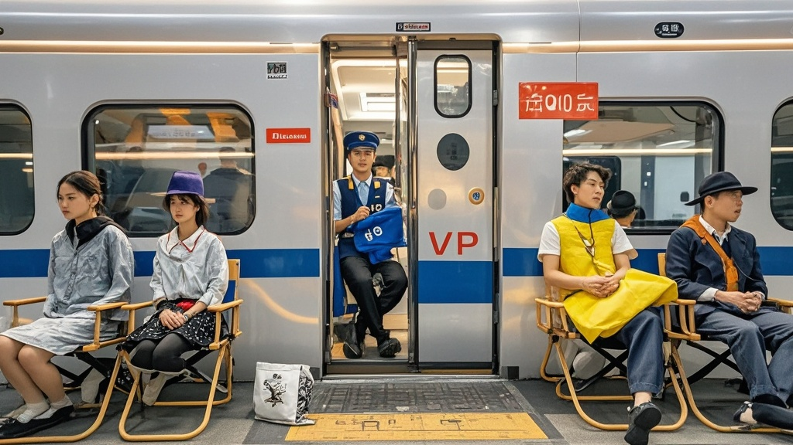

>无座乘客自带椅子坐高铁车门成‘守门员’视频爆火后，引发全民效仿，车门区域出现各类‘自定义座位’。铁路平台‘铁小通’紧急推出‘车门VIP座’收费服务，300元/次含折叠椅租赁等，引发乘客热议。
<!-- truncate -->

近日，一则‘无座乘客自带椅子坐高铁车门旁成守门员’的视频在社交平台爆火后，竟引发全国高铁乘客‘创意占座’热潮。据不完全统计，国庆假期前三天，全国各车次车门区域已出现折叠椅、沙滩椅、儿童摇摇椅甚至带杯架的‘豪华办公椅’等十余种‘自定义座位’，部分乘客更随身携带‘守门员专属手牌’，场面一度失控。

事件起源于乘客王铁柱的‘神操作’。9月28日，王铁柱购买了从江城到花城的无座票，为避免一路站到终点，他突发奇想携带折叠椅坐在1号车厢车门处，并用手机支架支起‘临时守门员，请勿拥挤’的提示牌。这段视频被邻座乘客拍下上传后，单日播放量突破2000万，评论区涌现‘原来无座还能这么玩’‘已下单折叠椅’等留言。

记者实地探访发现，10月2日的G123次列车上，车门区域已形成‘座位区’：52岁的李阿姨带着绣有‘车门VIP’的坐垫，27岁的程序员小张支起带USB充电口的电竞椅，甚至有家长给孩子准备了带护栏的‘高铁守门员专用儿童椅’。列车员无奈表示：‘现在车门都快成家具展览会了，有的椅子太宽还卡住车门，差点影响发车。’

面对这一‘新潮流’，铁路服务平台‘铁小通’今日紧急发布《关于规范高铁车门区域使用的通知》，宣布推出‘车门VIP座’收费服务——乘客可提前3天通过官方APP预约，300元/次的费用包含折叠椅租赁、免费扶门框防滑手套及‘车门景观位’专属乘车纪念证书。通知特别说明：‘经安全评估，车门区域承重上限为15把折叠椅/节车厢，超过数量将启动限流。’

对此，乘客反应两极分化。支持方表示‘300元比站着舒服’，反对方则吐槽：‘有这钱不如加两节车厢，或者把无座票降价。’更有网友调侃：‘建议开发‘厕所VIP座’，带马桶垫和香薰，肯定大卖。’

截至发稿，铁小通客服称‘车门VIP座’首日预约量已达5000单，而铁路部门正紧急研发‘可折叠式高铁专用车门椅’，预计下月投入使用。至于这场‘守门员’热潮何时降温，或许要等下一个‘高铁创意占座’方式出现了。

