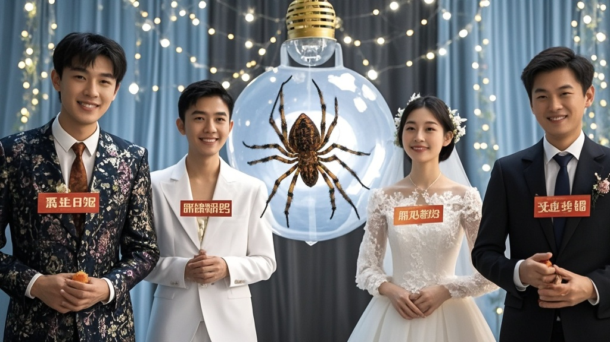

>山东曹州一场婚礼筹备现场因灯泡上的蜘蛛投影引发热议，视频走红后被解读为「天蛛吉兆」，民俗专家研讨、婚庆公司推出主题套餐、商家抢注商标，上演了一出荒诞的「蜘蛛经济」热潮，生态专家则提醒理性看待。
<!-- truncate -->

近日，山东曹州（化名）一场普通的婚礼筹备现场，因一只「不速之客」的蜘蛛意外走红网络，更引发了一场关于「天蛛吉兆」的全民热议。
 

据目击者李师傅（化名）回忆，10月15日凌晨3点，他在布置新娘家院门口的彩灯时，突然发现地面投下一个直径超2米的阴影。「刚开始以为是无人机，凑近一看，好家伙！灯泡上趴着只拳头大的花背蜘蛛，影子被灯光一拉，跟锅盖似的罩在地上。」李师傅边比划边说，「新娘妈妈当场就乐了，说这是『蜘蛛结网，姻缘绵长』。」
 

这段「巨型蜘蛛倒影」的视频经社交平台传播后，迅速引发全网玩梗热潮。有网友调侃「这才是真正的『珠联璧合』」，更有好事者翻出《齐民婚俗志》称：「古籍记载，蜘蛛落灯台，新人笑开怀，乃百年难遇的嫁娶吉兆。」
 

令人意外的是，当地民俗研究院竟连夜召开「蜘蛛吉兆研讨会」。该院研究员张守礼（化名）一本正经地解释：「蜘蛛在方言中谐音『喜蛛』，其织网形态与中国结纹路高度相似，结合现代光学原理，这种『光影喜蛛』现象的概率仅为0.003%，建议纳入非物质文化遗产候选名录。」
 

嗅到商机的婚庆公司更是火速跟进。曹州「红绣球」婚庆负责人王经理透露，公司已推出「天蛛赐福」主题套餐，包含定制蜘蛛造型灯串、蜘蛛元素手捧花，甚至提供「专业蜘蛛引位服务」——由饲养员携带温顺蜘蛛放置在指定灯泡上，确保投影效果。「套餐上线3天，已接了27单，最远的客户来自江苏徐州。」王经理难掩兴奋。
 

不过，也有生态专家泼冷水。市昆虫研究所陈教授提醒：「普通园蛛无毒，但盲目追求投影效果可能导致蜘蛛受强光刺激攻击人，建议新人理性看待民俗，莫让吉兆变『蜘蛛劫』。」
 

截至发稿，「蜘蛛倒影婚礼」话题阅读量已突破2亿，更有商家开始申请「天蛛吉兆」「光影喜蛛」等商标。至于那只引发热潮的「主角」蜘蛛，李师傅表示已将其放生到小区绿化带，「它完成使命了，该回家织网了。」

