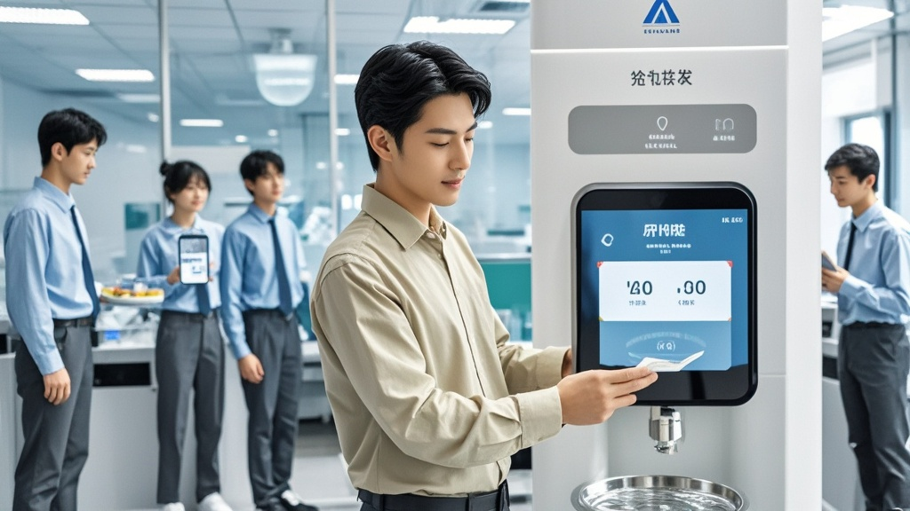

>康旭智联科技推行「精准饮水管理系统」，要求员工每日饮水需APP预约，单次限时3分钟，超时扣减午餐汤量。新制度引发员工困惑，公司称参考「前沿理论」优化效率，专家指出管理需守住人性底线。
<!-- truncate -->

<h3>【本报讯】</h3> 近日，互联网科技公司「康旭智联科技」因一项「创新管理制度」引发职场圈热议——该公司于10月15日起正式实施「精准饮水管理系统」，要求员工每日饮水需通过企业APP提前预约，单次饮水限时3分钟，超时将扣减当日午餐汤品供应量。  <b>「系统提示我现在不能喝水？」员工困惑难解</b> 据公司基层员工王小花（化名）向本报记者透露，新制度实施首日便状况频出。「早上9点半想接杯水，打开APP发现『9:30-9:35时段饮水名额已满』，最近的可预约时间是10:10。」她展示手机截图，系统界面显示每日设置4个「饮水窗口」，每个窗口仅开放20个预约名额，「我们部门30多人，经常抢不到，有人不得不带保温杯提前接好水，但被巡查的行政人员发现后，说『未预约饮水违反规定』。」  更令员工咋舌的是超时惩罚机制：若单次饮水超过3分钟（系统通过茶水间摄像头+智能水表双重计时），将按超时秒数扣减午餐汤量——每超时10秒，汤碗容量减少10%。「昨天我接水时和同事说了两句话，超时15秒，结果午餐的紫菜蛋花汤只有半碗，行政部还贴出公告说『这是为培养时间观念』。」王小花无奈表示。 
<b>公司回应：参考「前沿行为经济学理论」</b> 针对质疑，康旭智联科技人力资源总监李阳（化名）在内部沟通会上解释：「我们参考了剑桥大学最新研究，发现职场人日均无效饮水时间达27分钟，包括接水闲聊、调整水温等。通过精准管理，可将这部分时间转化为有效产出。」他强调，系统已预留「特殊情况通道」，如便秘、咽喉不适等可申请「紧急饮水额度」，但需提交三甲医院诊断证明。  <b>专家：管理创新需守住人性底线</b> 职场行为研究所研究员张立（化名）指出：「企业优化效率无可厚非，但将生理需求与绩效考核绑定，可能引发员工逆反心理。」他调侃道：「若按此逻辑，下一步是否要限制眨眼次数？毕竟医学统计显示，人每分钟眨眼15-20次，其中部分属于『无效眨眼』。」  截至发稿，康旭智联科技官网已挂出《关于「精准饮水管理系统」的补充说明》，称「将根据员工反馈优化预约时段，下阶段拟推出『唾液再循环系统』，通过智能水杯收集多余唾液，经处理后用于植物灌溉，实现资源循环利用」。
