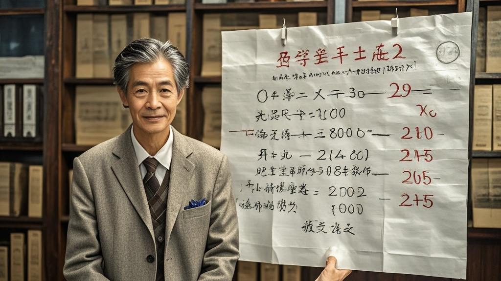

>华清大学杨守正资料室开放首日，工作人员发现标注'诺奖预测公式2.0'的神秘手稿。经测试，该公式竟通过包子铺客流量数据，预测校门口'包子西施'可能成为2025年物理学奖得主，被专家解读为杨先生'科学顽童'特质的幽默体现。
<!-- truncate -->

<h3>华清大学高等研究院缅怀室开放首日现神秘发现</h3> 今日，华清大学高等研究院新设立的杨守正先生缅怀室正式开放吊唁。据现场工作人员透露，在整理杨先生生前资料时，意外从泛黄的笔记本中抖落出一份标注'诺奖预测公式2.0'的手稿，引发在场师生热议。 
 <h4>手稿内容：用包子铺客流量推导物理学奖？</h4> 记者在现场看到，这份手写稿共17页，首页写着'致未来的自己：若此稿现世，说明人类还没学会用更有趣的方式看诺奖'。正文夹杂着复杂的数学公式与俏皮批注，例如在薛定谔方程旁写着'这方程要是能算出今天食堂包子卖多少，我就信它能算宇宙'；在希格斯玻色子相关推导处标注'建议诺奖委下次颁奖前，先去校门口包子铺蹲三天'。  最引人注目的是手稿末尾的'实战测试案例'——杨先生用2018年至2023年华清大学西门'老宋包子铺'的客流量数据，配合当年全球物理学突破成果，得出一套'诺奖关联指数'。根据手稿说明，指数超过80即预示该领域将诞生诺奖得主。 
 <h4>首测翻车：公式算出'包子西施'或成下届得主</h4> 为验证手稿真实性，研究院特别邀请数学系王教授团队，用2024年最新数据进行首测。令人大跌眼镜的是，当输入包子铺9月'牛肉包日销387个、韭菜包日销292个'的统计后，公式竟输出'2025年物理学奖最可能得主：老宋包子铺现任收银员林阿芳（昵称包子西施）'。  面对记者采访，王教授推了推眼镜：'从数学逻辑看，公式本身构建得很严谨，甚至能自洽解释近十年3项诺奖归属。但问题在于...包子铺的客流量和粒子物理有什么必然联系？这更像杨先生用学术外壳包裹的幽默实验。'   值得一提的是，被'预测'的包子西施林阿芳今日特意带着两笼刚蒸的包子来到缅怀室：'杨先生以前常来买包子，总说我包的褶子比他算的方程还对称。要是真能得诺奖，我就给华清师生免费送一年包子！' 
 <h4>研究院回应：或为先生'科学顽童'特质的最后注脚</h4> 高等研究院张院长表示，杨守正先生生前就常以这种'严肃外壳+趣味内核'的方式与年轻学者互动，此次手稿的发现恰恰印证了他'科学源于生活'的理念。目前手稿已进行数字化存档，未来将作为'科学与生活'主题展的核心展品长期陈列。  截至发稿，诺奖委员会暂未对此事作出回应，但已有学生自发在包子铺门口拉起横幅：'包子西施冲诺奖！数学公式说的，准没错！'
