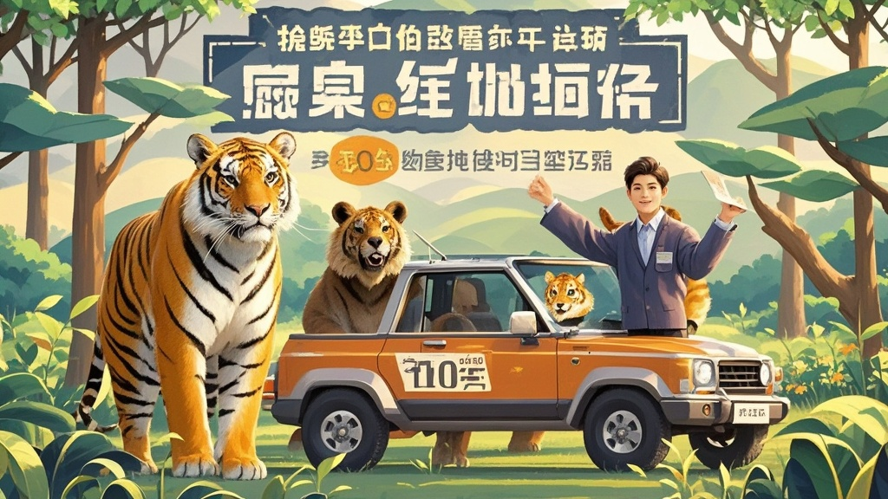

>中原野生萌宠乐园推出‘兽群通勤管家’岗位，月薪10万招聘负责接送猛兽‘上班’的司机，要求掌握猛兽语言、通过与虎熊共乘试驾等离谱测试，引发求职者热议。
<!-- truncate -->

<h3>【本报郑州讯】</h3>
近日，中原野生萌宠乐园在招聘平台发布一则‘兽群通勤管家’岗位，开出月薪10万元的天价薪酬，却因离谱的招聘条件引发全网热议。

据乐园官方招聘启事显示，该岗位主要负责每日驾驶定制版‘猛兽通勤车’，接送老虎、棕熊等大型兽类从兽舍到活动区‘上班’，同时需完成途中喂食、情绪安抚等工作。最引人注目的是任职要求： 1. 持有‘猛兽驾驶资格证’（需通过‘与东北虎共乘试驾’路考）； 2. 掌握‘熊科动物晨间问候语’‘猫科猛兽减速带提示语’等猛兽语言四级水平； 3. 能徒手用肉干引导猛兽配合系‘安全绳’（注：特制弹力绳，防挣脱）； 4. 需通过‘熊口夺食’抗压测试——在棕熊进食时用玩具球转移其注意力，确保按时发车。

记者致电乐园运营总监牛大柱（化名），对方解释称：‘现在猛兽也讲究生活品质，我们观察到老虎上班总迟到，熊群坐车时老抢副驾，所以需要专业管家协调。’他特别强调，薪酬虽高但有‘绩效扣减项’，比如‘老虎途中打哈欠导致延误’扣500元，‘棕熊扒车窗’扣800元，‘被狮子拍爪子要签名’扣1000元。

招聘信息发布24小时内，已有300余人投递简历。其中一位自称‘能和狗聊通宵’的宠物训练师表示：‘熊语应该和狗语差不多，大不了现场现学。’而某驾校教练则纠结：‘考普通驾照要科目一到四，这猛兽驾照得考科目五（和老虎对眼神）吧？’

截至发稿，乐园已安排首批面试，内容包括‘用胡萝卜泥写熊文情书’和‘驾驶玩具车带小狮子绕桩’。牛大柱透露：‘我们不要求学历，但必须能让猛兽主动上车，毕竟它们才是甲方。’

