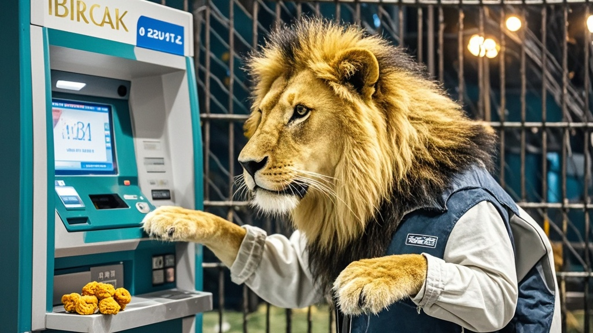

>皖北梨城金鬃马戏团狮子"阿福"被曝在ATM机前模仿人类取钱，前爪按密码、排队等待有模有样，最终被肉干诱回笼子，银行设备未受损坏仅留狮毛。
<!-- truncate -->

10月24日上午，皖北梨城街头上演离奇一幕——金鬃马戏团的明星狮子"阿福"，被市民拍到在某银行ATM机前"办理业务"。监控画面显示，这头体长约2米的非洲狮竟像模像样地站在黄线外排队，前爪搭在密码键盘上"输入密码"，引发现场群众惊呼。

据目击者王女士回忆："我正准备取钱，就看它从马戏团卡车后面溜达过来，先在一米线外蹲了会儿，等前面的人走了才凑过去。前爪在键盘上扒拉得可快了，屏幕都亮了，差点以为是哪个戴狮头套的行为艺术家。"银行保安老张表示，当时机器显示"交易失败"，狮子还抬起头冲屏幕低吼，"那眼神活像在说'密码错了？'"。

马戏团驯兽师李师傅解释，阿福是团里最聪明的动物，平时训练时会模仿敲鼓、敬礼等动作，"可能是看游客取钱次数多了，自己学了个半吊子"。最终工作人员用一块带血的牛肉干成功将其诱回笼子，此时阿福的前爪还紧紧攥着一张被它"拍"出来的凭条。

银行方面表示已联系技术部门检查设备，"万幸没吞卡也没吐钱，就是键盘上沾了几根狮子毛"。当地派出所提醒："动物模仿人类行为虽有趣，但遇到大型动物仍需保持安全距离。"

