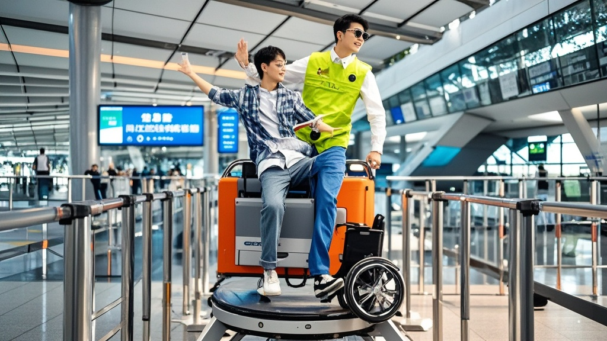

>深圳宝安机场被曝进行‘智能登机辅助系统压力测试’，残障歌手陈智华体验时遭遇会旋转的升降车，登机过程堪比跑酷。机场回应称系验证‘动态平衡升降技术’，引发网友热议‘登机变综艺’的荒诞操作。
<!-- truncate -->

<b>极目洋葱讯</b> 10月25日，知名创作型歌手陈智华在社交平台发布一段‘沉浸式登机’视频，引发全网热议。视频中，坐在轮椅上的陈智华面对离机门45公分高的升降车板，一边单手扶着轮椅，一边试图用另一侧手臂勾住机舱门框，而升降车竟随着机场广播节奏缓缓旋转，场面堪比综艺《极限挑战》录制现场。  据陈智华描述，当日他乘坐航班从深圳飞往成都，值机时已提前申请轮椅服务。但抵达远机位后，迎接他的不是平稳的升降车，而是一台‘会跳舞的登机神器’：‘升降板先升到离地30公分，我刚调整好轮椅角度，它突然开始顺时针转圈圈，司机还冲我喊“配合音乐节奏更丝滑”——我轮椅轮子都快磨出火星子了！’  视频末尾，陈智华最终以‘轮椅漂移+单腿跨越+手臂支撑’的高难度动作成功登机，额角已渗出薄汗：‘建议机场把这项目申报非物质文化遗产，以后残障旅客登机前得先考个跑酷二级证书。’ 
 深圳宝安机场公关部晚间回应称，此系机场联合某科技公司进行的‘智能登机辅助系统压力测试’，旨在验证‘动态平衡升降技术’在复杂场景下的稳定性。‘我们没想到旅客会自主开发出跑酷式登机法，这充分展现了乘客的创新精神。’工作人员补充道，目前已将‘旋转模式’调整为‘蹦迪模式’，下阶段将邀请广场舞队参与测试。  截至发稿，该视频播放量已突破2000万，评论区热传‘深圳机场隐藏项目：登机版《这！就是街舞》’‘建议同步开发登机专用护膝’等调侃留言。
