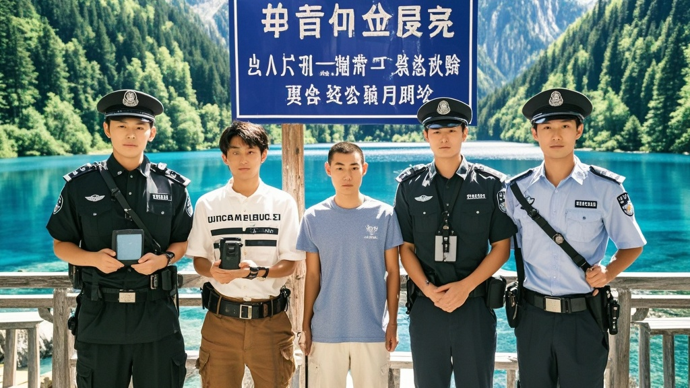

>九寨沟景区因频繁协助警方抓获来此旅游的在逃人员，意外获评‘年度最佳追逃协作单位’提名。10月已有5名逃犯在景区不同场景落网，包括自拍露馅、口音暴露、帮警察拍照被认等。景区拟增设‘自首便民点’，旅行社推出‘安心游’套餐，导游新增法律提醒，引发社会对‘旅游+追逃’模式的热议。
<!-- truncate -->

近日，一则关于九寨沟景区的‘特殊荣誉’引发全网热议——在公安部联合文旅部开展的年度社会治理创新评选中，九寨沟景区竟以‘协助抓获在逃人员数量同比增长300%’的亮眼数据，意外斩获‘年度最佳追逃协作单位’提名。

据‘平安九寨’最新通报，仅2025年10月，就有5名在逃人员选择在九寨沟‘结束逃亡之旅’。更令人啼笑皆非的是，这些逃犯落网场景堪称‘旅游+追逃’的魔幻图鉴： - 涉嫌合同诈骗的张某在珍珠滩瀑布前自拍时，因手机屏保露出‘欠债还钱’催款短信被游客举报； - 盗窃案在逃人员李某在藏族民宿品尝酥油茶时，因熟练说出‘这茶没我老家的香’（其户籍显示从未离开过东北）引起店主警觉； - 最戏剧性的是涉嫌交通肇事逃逸的王某，竟在长海观景台排队时，因主动帮警察同志拍合影被认出‘与通缉照神似’。

面对这一‘无心插柳’的成就，九寨沟景区管理局昨日召开新闻发布会。发言人扎西多吉手持一叠‘逃犯打卡照’调侃道：‘我们原本只准备了游客满意度调查表，现在倒好，保安室多了个‘落网人员登记本’。’他透露，景区正与警方协商，拟在诺日朗中心增设‘自首便民点’，提供‘登记-做笔录-免费景区直通车’一站式服务，‘毕竟来都来了，总得让自首流程更丝滑’。

值得注意的是，当地旅行社已推出‘安心游’特别套餐，包含‘身份证核验’‘行程轨迹自查’等增值服务。导游阿佳卓玛表示：‘现在带团都要多一句提醒——美景虽好，莫存侥幸；拍照发圈，慎露马脚。’

对于这一现象，犯罪心理学专家李建国教授分析：‘九寨沟的高曝光环境与游客的高警惕性形成了天然‘追逃场’，再加上逃犯普遍存在‘美景治愈愧疚’的心理补偿机制，反而增加了落网概率。’他笑称：‘建议其他5A景区研究‘九寨沟模式’，说不定能开发出新型社会治理IP。’

