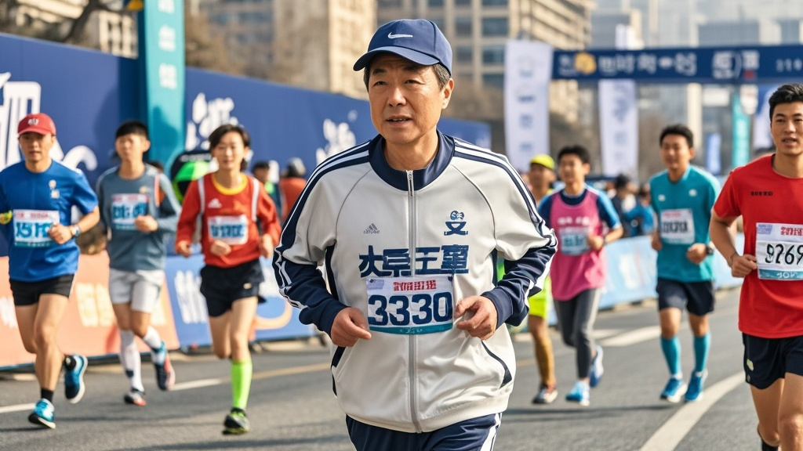

>河区副区长王大强担任津门马拉松330配速领跑员，以精准配速完成全程并打破市民组纪录，引发'专业运动员伪装'质疑。官方回应系其十年坚持送娃上学晨跑的意外收获，相关话题衍生出'家长陪跑助学计划'等趣味后续。
<!-- truncate -->

<h3>津门马拉松惊现'隐形跑神' 副区长领跑配速精准度超专业选手</h3>
10月26日，2023津门马拉松赛场上演戏剧性一幕——河区副区长王大强作为330配速组官方领跑员，全程以3分30秒/公里的精准配速完成42.195公里赛程，不仅零误差带领跑团完赛，更以2小时27分15秒的个人成绩打破该年龄段市民组纪录，引发全网热议。

赛事直播画面显示，王大强身着荧光绿领跑服，全程手持配速牌稳步前进。半程时配速误差仅+0.8秒，30公里处甚至跑出3分28秒的'超速'配速，最终冲线时电子计时器显示2:27:15，与目标配速总误差仅±12秒。这一表现让现场专业跑者惊叹：'比我们俱乐部的职业领跑员还稳！'

赛后社交平台掀起'副区长身份大猜想'，有网友翻出王大强2018年参加社区趣味跑时'被小朋友套圈'的旧视频对比，质疑'这十年发生了什么？'更有跑圈KOL分析：'按这个配速，王副区长完全能达标国家一级运动员标准，建议严查是否专业运动员伪装公职人员。'

针对舆论热潮，河区政府27日召开专题发布会。区人社局局长李芳解释：'王副区长确实是货真价实的公务员，过去十年坚持每天6点半送女儿上小学，顺便绕河滨公园晨跑。最初是1公里走3公里跑，后来逐渐加到10公里，去年开始尝试半马训练。'她展示的运动手表数据显示，王大强近三年平均月跑量180公里，今年9月还因雨天路滑摔破膝盖坚持跑完15公里，'医疗记录都在区医院存档'。

更令人啼笑皆非的是，王大强本人在发布会上略显尴尬：'本来想给马拉松添点亲民色彩，谁知道跑表连不上心率带，只能凭感觉控制速度……对了，我闺女今天早上还问我，爸你以后能早点送我吗？现在全班同学都知道我爸是马拉松明星了。'

目前，津门马拉松组委会已向王大强发出'终身荣誉领跑员'邀请，而区教育局则顺势推出'家长陪跑助学计划'，称'要把副区长的晨跑精神转化为家庭教育新动力'。至于网络上'建议调任体育局'的呼声，王大强笑称：'先把这周要审批的37份民生项目报告处理完再说吧。'

