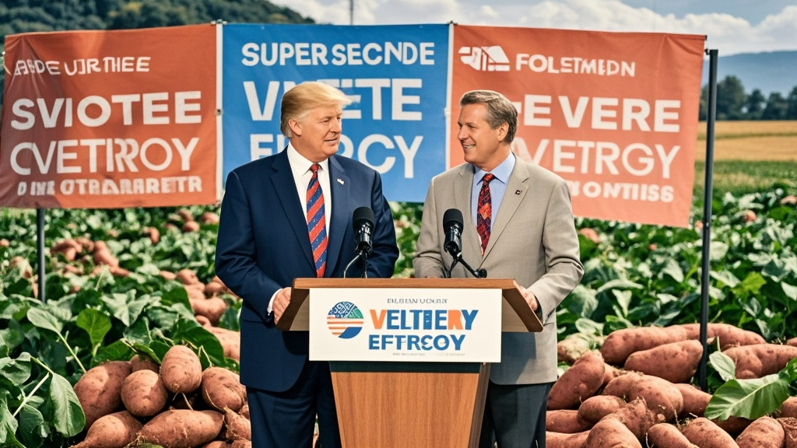

>特伦普与马斯科宣布联合研发‘超级选民能量棒’，声称食用可提升投票热情，却被曝光核心原料是农民秋收剩余红薯，引发多地红薯地被哄抢，网友和专家纷纷吐槽其荒诞性。
<!-- truncate -->

近日，前白宫主人特伦普与科技圈传奇马斯科的‘世纪和解’再爆猛料。据二人今日在得州‘星际牧场’联合召开的新闻发布会透露，双方已成立‘选民动力实验室’，将推出革命性产品——‘超级选民能量棒’，宣称食用后可‘提升300%投票热情，单场选举多投三票’。

发布会上，特伦普手持金色包装的能量棒振臂高呼：‘这是民主的能量！我和马斯科说，我们需要让选民更有动力，他立刻说“用我的脑机接口技术”，但我说“不，要更接地气！”’马斯科则推了推墨镜补充：‘经过237次配方调整，我们终于找到核心成分——来自东海岸农场的“魔力红薯”。’

这一说法迅速引发媒体追问。《乡村邮报》记者实地探访马斯科提到的‘秘密红薯基地’，却发现所谓‘魔力红薯’竟是当地农民老王秋收后留在地里的剩余作物。老王挠头表示：‘前儿还愁没人捡，这两天突然来好几百人挖，我家二亩地都快被刨成溜冰场了！’

营养专家李教授在接受采访时哭笑不得：‘红薯富含膳食纤维不假，但和投票热情有什么关系？除非他们在棒子里加了咖啡因——可检测报告显示，主要成分是淀粉、糖和红薯泥。’更戏剧性的是，某电商平台数据显示，‘选民能量棒’预售链接上线1小时即被抢空，评论区出现‘给我家狗也买两根，万一它想投票呢？’‘吃了能给偶像多打榜吗？’等迷惑发言。

截至发稿，特伦普团队回应称‘热情是主观感受，数据由选民自己定义’，马斯科则在社交平台发布动态：‘下一款产品是“总统竞选能量奶茶”，原料可能是黄山悬崖边捡的手机壳，敬请期待。’

