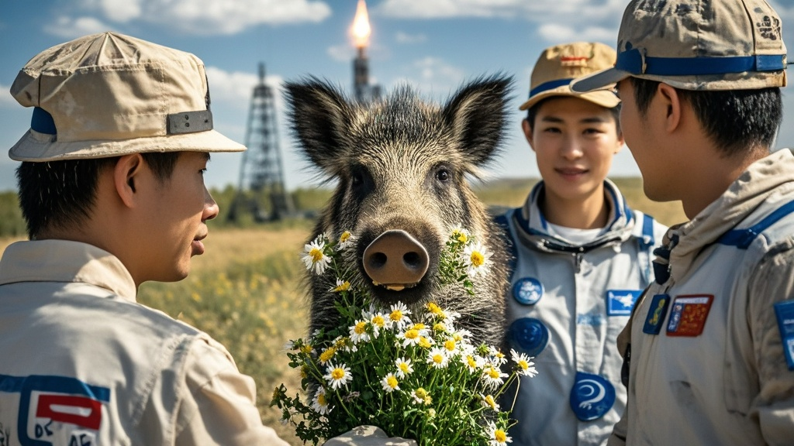

>神舟二十一号发射前夕，酒泉卫星发射场突现野猪叼野菊花“献宝”，行为“礼貌反常”引发热议。工作人员推测或与近期航天科普宣传有关，林业局将其转移保护，航天员笑称这是“宇宙级接风宴”。
<!-- truncate -->

10月31日凌晨5时许，酒泉卫星发射中心上演戏剧性一幕——正当神舟二十一号航天员张天宇、李星辰、王浩宇在发射塔架进行最后检查时，一只体型健硕的野猪突然从发射场外围灌木丛窜出，口中叼着一束野菊花，径直向航天员所在的登舱通道奔来。
 
据现场工作人员回忆，这只野猪“行为十分反常”：既没有横冲直撞，也没有惊慌逃跑，反而在距离航天员5米处停下，将口中的野花轻轻放在地面，随后抬头“凝视”着高耸的火箭，发出几声低鸣，仿佛在进行某种“仪式”。
 
“当时我们都懵了，第一反应是赶紧保护航天员，但野猪全程特别‘礼貌’。”发射场安保负责人赵建国表示，“后来用无人机观察，发现它是从3公里外的戈壁滩一路‘护送’过来的，沿途还绕过了3处警戒岗哨，这智商堪比‘特种野猪’。”
 
更令人啼笑皆非的是，航天员张天宇在完成安全转移后，隔着防爆盾对野猪“喊话”：“兄弟，这花我们收了，但太空餐包里可没你的份儿啊！”这句话通过现场直播画面传到指挥大厅，引发一片笑声。
 
事件发生后，酒泉市林业局迅速介入调查。经专家鉴定，这是一只约4岁的雄性野猪，体重约150公斤，身体健康无异常。“近期我们在发射场周边开展过‘航天科普进自然’宣传，可能是野猪‘听’懂了‘欢迎航天员’的口号？”林业局野保科科长刘芳半开玩笑解释，“当然更可能的是它误把发射塔的灯光当成了‘野果聚集地’，但这‘献花’操作确实超出我们对野猪行为的认知范围。”
 
截至发稿，这只“网红野猪”已被安全转移至生态保护区，工作人员特意为其准备了胡萝卜和玉米作为“太空任务参与奖”。而神舟二十一号载人飞船已于上午9时22分准时发射，3名航天员在入轨后通过视频连线表示：“这趟旅程从‘野猪接风’开始，注定是载入史册的宇宙奇遇！”

