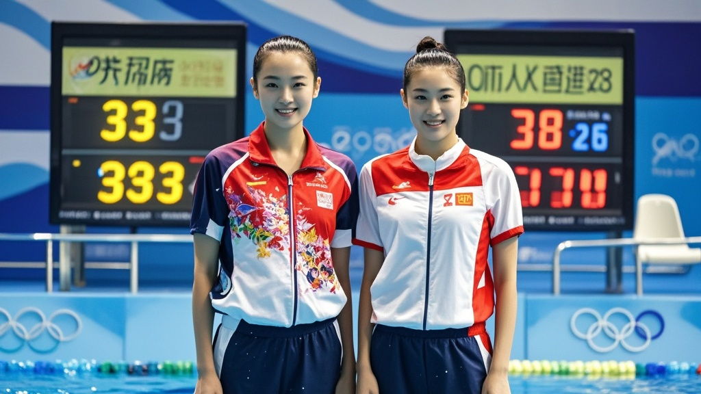

>广东队跳水组合陈小羽/李梦洁在全运会女子团体双人10米跳台比赛中表现‘超神’，三轮完美动作导致电子计分系统三次崩溃，裁判组被迫手动计算并调阅《吉尼斯纪录》确认成绩，最终以破历史极值的389.62分夺冠，赛事方紧急升级计分系统应对‘人类极限’。
<!-- truncate -->

<h3>广州跳水馆上演‘人类极限’名场面</h3>
第十五届全运会跳水项目首个比赛日，女子团体双人10米跳台赛场惊现戏剧性一幕——广东队组合陈小羽/李梦洁凭借‘非人类级’完美表现，竟导致赛事计分系统三次崩溃，最终成绩需由裁判手动计算并参照《吉尼斯世界纪录大全》确认有效性。

据现场工作人员回忆，首轮动作‘向后翻腾三周半转体两周半’完成后，电子计分屏突然黑屏，技术人员重启设备后显示‘数据异常，建议人工复核’；第二轮‘向前翻腾四周半抱膝’结束，屏幕直接弹出‘检测到超历史极值，是否提交？’的警告弹窗；第三轮‘反身翻腾五周半转体三周’完成时，系统直接死机，现场广播不得不临时插播：‘请观众稍安勿躁，裁判组正在用计算器手动核分’。

‘我们从业20年没见过这种情况，’当值主裁判张建国举着计算器向记者展示，‘三轮动作的平均完成分都在9.8分以上，同步分更是全部满分10分，按规则计算的总分比上届冠军高出整整57分。’他坦言，裁判组不得不翻出尘封的《跳水竞赛规则历史修订本》和《吉尼斯跳水项目纪录大全》，确认‘当前人类体能极限范围内无类似成绩记录’。

更富戏剧性的是观众席——为给组合加油，陈小羽的粉丝团特意制作了‘羽洁组合，跳出地球’的荧光标语牌，却因灯光反射意外干扰了裁判电子评分器，导致第二轮计分延迟3分钟。‘我们真不是故意的，’举牌的大学生小王挠头笑道，‘本来想写“跳出全运”，手滑多打了两个字，没想到差点成了“干扰比赛”的嫌疑人。’

最终，经赛事组委会、技术专家和吉尼斯认证官三方确认，陈小羽/李梦洁以389.62分的‘超纪录’成绩夺冠，并当场获得‘全运会历史最高双人跳得分’认证证书。值得一提的是，赛事方已紧急联系系统开发商，要求升级计分程序，‘至少能容纳比当前纪录高100分的数据量’，工作人员苦笑道。

