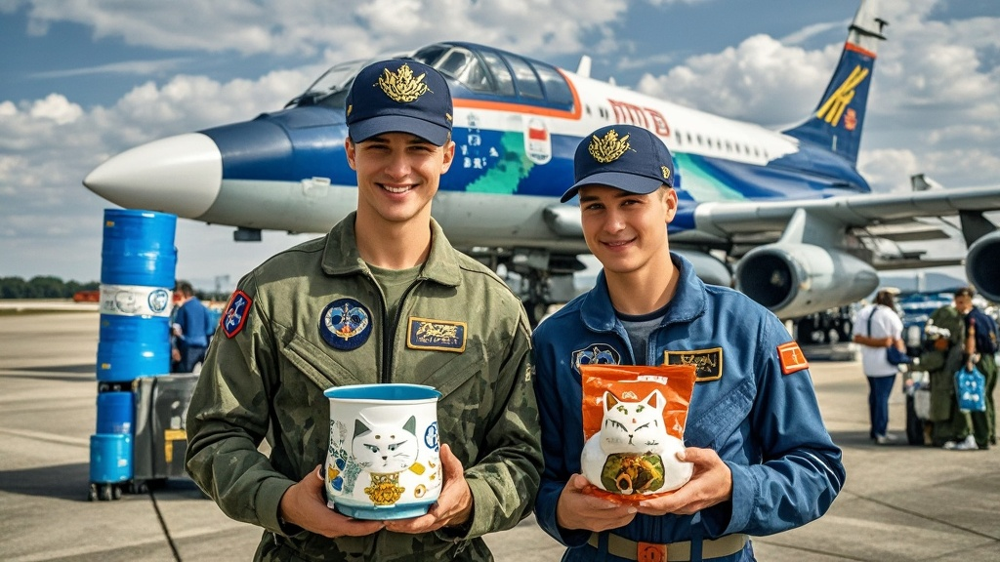

>俄罗斯'极光'飞行表演队结束南昌飞行大会后，因疯狂采购南昌拌粉套装、陶瓷猫窝、文创雪糕等特色商品，导致运输机超重被迫卸货。飞行员称采购是为给战友带'战术补给'，最终不得不舍弃部分'战斗民族保温杯'完成起飞，延续了俄罗斯飞行员在中国'扫货'的趣味传统。
<!-- truncate -->

<h3>本报南昌讯（记者 赣鄱观）</h3>
刚结束2025南昌飞行大会的俄罗斯'极光'飞行表演队，近日在返程前上演了一出'运输机超载惊魂记'。据昌北国际机场地勤人员透露，原本计划11月4日10点起飞的伊尔-76运输机，因货舱超重被迫推迟3小时，最终不得不'含泪'卸下半车'战利品'。

记者在机场货运区看到，被卸下的货物包括：50箱南昌拌粉制作套装（含瓦罐、秘制辣酱）、30套景德镇陶瓷猫窝（飞行员解释'给基地流浪猫改善生活'）、20个印着'滕王阁'字样的保温桶（飞行员误认为是'新型战术热食容器'），以及最让人啼笑皆非的——100支'落霞与孤鹜齐飞'主题文创雪糕（已全部冻成'冰雕'）。

'他们简直把昌南大道的商超搬空了！'全程陪同的翻译小李哭笑不得，'队长彼得·科瓦廖夫一开始只说想买点中国特色，结果看到拌粉现场制作就走不动道，说要带回去给地勤组开'东方美食课'；看到陶瓷猫窝又说基地的流浪猫'值得住上景德镇官窑'；最绝的是文创雪糕，飞行员们非说'带回去给战术指挥中心当紧急冷餐'。'

更戏剧性的是，当运输机称重显示超重1.2吨时，飞行员们竟现场召开'货物取舍会议'。有人坚持'拌粉套装是文化交流重点'，有人强调'陶瓷猫窝关乎动物福利'，最后还是机长一锤定音：'把之前买的战斗民族保温杯全扔了！反正咱们喝伏特加不需要保温！'最终，30个印着'战斗民族永不言败'的不锈钢杯被留在了机场仓库。

据了解，这已不是俄罗斯飞行员首次在中国'扫货'。2024年珠海航展期间，就有飞行员因携带20箱青岛啤酒登机被海关'友情提醒'；2023年长春航空展，某飞行员甚至试图托运东北大花被，理由是'比俄罗斯军毯更保暖'。

对于此次'超载事件'，南昌航空产业博览会组委会表示：'我们非常欢迎国际友人感受南昌文化，但下次建议提前联系物流，我们可以提供'战斗民族扫货专线'服务！'而俄罗斯飞行表演队在离境前通过社交媒体留言：'中国的美食和文创太有魔力了！下次我们开安-124来！'（完）

